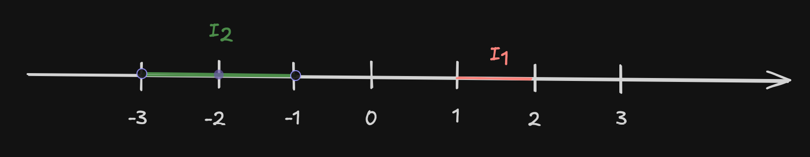

# Repetition

## Funktionen

Formelle Ausdrucksweise:

$f : x \mapsto y = f(x)$

$D$ (Definitionsbereich) $\mapsto W$ (Wertebereich)

Beispielfunktion:

$f: x \mapsto \frac{1}{x}$

$D = \{x | x \in \mathbb{R} \land x \neq 0 \}$

$W = \{ x \in \mathbb{R} | x \neq 0 \}$

## Intervalle

$ I_1 = [1;2]$ = geschlossenes Intervall

$ I_2 = (-2;0]$ oder $ I_2 = ]-2;0]$ = halboffene Intervall → -2 ist im Intervall nicht beinhaltet.

# Geradensteigung

