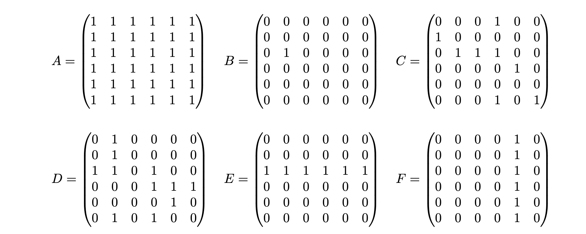

# Series 3 Aufgabe 5

Gegeben sind folgende Matrizen:

a) ∀i ∈ {1, 2, . . . , 6}: ∀j ∈ {1, 2, . . . , 6}: P (M, i, j)

b) ∀j ∈ {1, 2, . . . , 6}: ∀i ∈ {1, 2, . . . , 6}: P (M, i, j)

c) ∃i ∈ {1, 2, . . . , 6}: ∃j ∈ {1, 2, . . . , 6}: P (M, i, j)

d) ∃j ∈ {1, 2, . . . , 6}: ∃i ∈ {1, 2, . . . , 6}: P (M, i, j)

e) ∀i ∈ {1, 2, . . . , 6}: ∃j ∈ {1, 2, . . . , 6}: P (M, i, j)

f) ∀j ∈ {1, 2, . . . , 6}: ∃i ∈ {1, 2, . . . , 6}: P (M, i, j)

g) ∃i ∈ {1, 2, . . . , 6}: ∀j ∈ {1, 2, . . . , 6}: P (M, i, j)

h) ∃j ∈ {1, 2, . . . , 6}: ∀i ∈ {1, 2, . . . , 6}: P (M, i, j)

## Lösungsweg a

