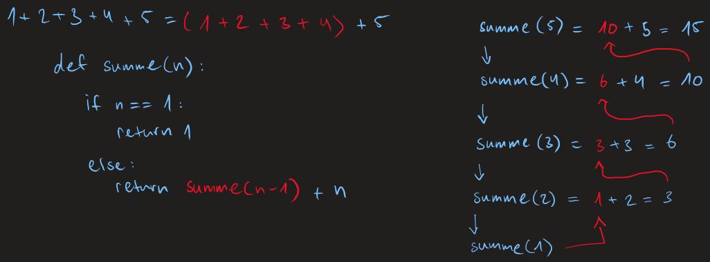

# Rekursive Algorithmen

Eine Methode zur Problemlösung indem bei der eine Funktion sich selbst aufruft, um kleinere Instanzen desselben Problems zu bearbeiten.

- Eine Funktion kann für kleinen Input, etwa für n = 1 effizient direkt berechnet werden
- Für einen grossen Input-Wert n teilen wir das Problem in gleiche Probleme mit kleinerem Input-Wert und bestimmen deren Lösung.
- Dann rekonstruieren wir aus diesen Teillösungen den gesuchten Output-Wert für n

Solche Verfahren heissen devide-and-conquer Algorithmen

Beispiel: Bestimme die rekursive Algorithmen zur Berechnung der Summe der ersten n natürlichen Zahlen und zur Berechnung der Fakultät n! Zeichne den Rekursionsbaum für n = 5

