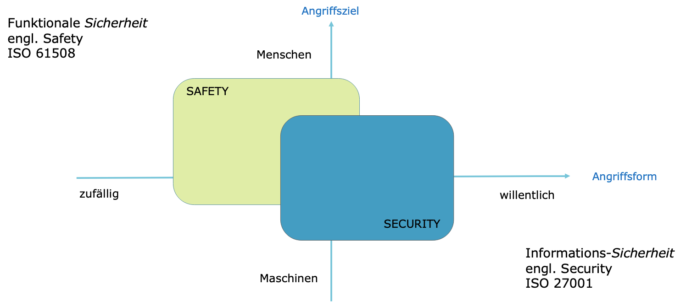

# Information Security Fundamentals

## Definition Daten, Information und Wissen

Information ist die Verknüpfung von Daten in Form von Zahlen, Worten und Fakten zu interpretierbaren Zusammenhängen. Durch die Vernetzung von Informationen entsteht Wissen, das zunächst personenbezogen ist.


## Gefahren

Menschliches Fehlverhalten

- Fahrlässigkeit
- Gleichgültigkeit
- Unwissenheit
- Leichtgläubigkeit

Organisatorische Schwachstellen

- Fehlendes Sicherheits-verständnis des Managements
- Unklare Verantwortlichkeiten
- Ungenaue oder fehlende Abläufe / Prozesse
- Fehlende Strategie und Konzepte
- Mangelhafte Richtlinien
- Mangelhafte Awareness der Mitarbeitenden
- Fehlende Kontrollen

Techniches Versagen

- Ungenügende Wartung
- Nicht funktionierende Überwachungssysteme
- Falsch dimensionierte Systeme
- Fehlerhafdte Konfiguration
- Fehlerhafte Applikationen / Betriebssysteme / Firmware / Treiber

Höhere Gewalt

- Unwetter, Erdbeben, Überschwemmungen, Vulkanausbrüche
- Feuer, Wasser
- Ausschreitungen, Geiselnahme, Krieg

Willentliche, vorsätliche Angriffe

- Unerlaubter Zugriff auf Systeme
- Abhören und Modifizieren von Daten
- Angriff auf die Verfügbarkeit von Systemen (Distributed Denial-of-Service DDOS)
- Missbrauch von Systemen
- Viren, Würmer und Trojaner
- Drive-by-infections

## Grösste Bedrohungen für Daten und Informationen gemäss ENISA 2024

1. Ransomware
2. Malware
3. Social Engineering threats
4. Threats against data: Data breaches
5. Threats against availability: Denial of Service
6. Information manipulations
7. Supply-chain attacks

# Grundbegriffe Sicherheit und Risiko

## Sicherheit

Sicherheit bezeichnet einen Zustand, der frei von unvertretbaren Risiken der Beeinträchtigung ist, oder als gefahrenfrei angesehen wird. (Definition Wikipedia)

Absolute Sicherheit ist nicht erreichbar und auch nicht bezahlbar!

### Safety vs. Security

|          | Safety                                                     | Security                                         |
|----------|------------------------------------------------------------|--------------------------------------------------|
| Ziel     | Schutz vor zufälligen, ungewollten Vorfällen               | Schutz vor willentlich ausgeführten Vorfällen    |
| Gefahr   | Umwelt passt sich nicht an, um Schutzmassnahmen zu umgehen | Angreifer passt sich Schutzmassnahmen an         |
| Diziplin | Schwerpunkt Naturwissenschaften und definierte Experimente | Soziale Wissenschaften, ständig änderndes Umfeld |



### Informations-Sicherheit, Cyber-Sicherheit und IT-Sicherheit

Informations-Sicherheit
- Schutz der Information als solche
- Unabhängig vom Medium (Digital, Papier, Wissen in den Köpfen der Mitarbeiter)

Cyber-Sicherheit / Internet-Sicherheit
- Schutz von Internet-basierten Systemen und Anwendungen

IT-Sicherheit
- Schutz von Informations- und Kommunikations-Systeme gegen Gefahren und Angriffe


### Informations-Sicherheit vs. Datenschutz

Informations-Sicherheit
- Schutz aller Daten und Informationen durch Massnahmen
- Ziel ist es mögliche Schwachstellen und Bedrohungen zu identifizieren, um entsprechende Massnahmen von Vorfällen zu minimieren
- Regelungen durch Gesetze, Standards und Normen (ISO/IEC 27001)

Datenschutz
- Basiert auf dem Grundrecht zur informationellen Selbstbestimmung
- Jede Person darf über die Verarbeitung, Verwendung und Weitergabe der persönlichen Daten entscheiden
- Ziel ist der Schutz personen-bezogenen Daten
- Regelung durch Schweizer Datenschutzgesetz (DSG) und Vorgaben der Branchen

## Risiko

Definition: Unter einem Risiko ist ein eventuelles, durch Eintrittswahrscheinlichkeit und Auswirkung bewertetes Ereignis, das einen negativen Einfluss hat.

```
Risiko = Wahrscheinlichkeit oder Eintretenshäufigkeit * Schadensausmass
```

# Grundschutzziele der Informationssicherheit

C-I-A

- Confidentiality
    - Ist gegeben wenn sichergestellt wird, dass Informationen nicht durch unautorisierte Personen, Instanzen oder Prozesse eingesehen werden
- Integrity
    - Ist gewährleistet wenn Daten oder Systeme nicht unautorisiert manipuliert werden
- Availablility
    - Ist gewährleistet wenn der Benutzer in gewunschter Zeit auf Dienste oder Informationen zugreifen kann

# Informationssicherheit

Die Informationssicherheit besteht aus drei Säulen

- Techik
    - Sie muss gekauft und konfiguriert werden
- Prozessen
    - Werden definiert und kontrolliert
- Mitarbeitende
    - Müssen sensibilisiert und ausgebildet werden

Um die Informationssicherheit zu gewähleisten, können 5 Schritte gemacht werden:

1. Sichern
2. Schützen
3. Überwachen
4. Vorbeugen
5. Aufpassen

## Sichern

Daten sollen in eine Backup gespeichert werden. Hier ist die 3-2-1 Regel zu beachten: Drei Kopien auf zwei verschiedene Speichermedien wobei eines an einem externen Standort geschickt wird.

## Schützen

Hier geht es um die korrekte konfiguration der Technik. Beispielsweise könnte man für Daten die nur in eine Richtung abfliessen sollen Daten Dioden verwenden: Unidirektionale Datenverbindung zwischen virtualisierte Gastsysteme
Anwendungsbeispiele: Geheimnisschutz oder Infrastrukturschutz

Weitere Themen sind beispielsweise:

- Komplexität der Passwörter
- Wechsel der Passwörter
- MFA und Passkeys
- Malware filtering
- Antivirus
- Modesecurity
- Intrusion detection and prevention

## Überwachen

Intrusion Detection System (IDS)
- Passiv
- Logging & Alerting
- L4 - L7

Intrusion Prevention System (IPS)
- Aktiv
- Stoppt Angriffe
- L4 - L7

Web Application Firewall (WAF)
- Nur L7

Virenschutz (Nur ca. 45% der Viren werden entdeckt)
- Viel vertrauen an Hersteller Notwendig
- Benötigt Verbindung nach aussen

## Vorbeugen

Als basis NIST-CSF
- Preventiv: Identify -> Protect -> Detect
- Reaktion: Detect -> Respond -> Recover
Forensic Readiness
- Strategie bei Incidents
- Definierte Policies und Procedures
- Technologie dediziert für dies
- Digital Forensic Response (Spurensicherung vs. Verfügbarkeit)
- Control und Compliance
Vulnerabilities Management
SW-Updates
Awareness und Training

## Aufpassen

- Passwörter Anpassen
- Sich informieren / weiterbilden
- Sicherer Umgang mit Sozialen Medien

