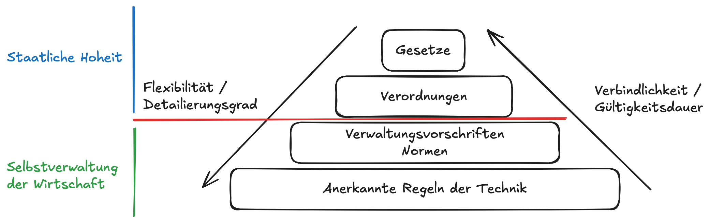

# Navigation

- [Standards](#standards)
    - [Anglizismen](#anglizismen)
    - [IEC](#iec---international-electrotechnical-comission)
    - [EN](#en---die-europäischen-normen)
    - [ISO](#iso---international-organisation-für-normierung)
    - [Kritik](#kritik)
    - [Standards in Informationsicherheit](#standards-mit-verbindung-zu-informationssicherheit)

# Standards

Standards oder auch Normen genannt, stehen zur Anwendung frei und sind nicht Gesetzlich vorgeschrieben. Normen sind nur dann rechtlich bindend wenn sie in einem Vertrag enthalten sind. Standards gelten oft als Massstab für Best Practices bei beispielsweise Produkthaftung.



## Anglizismen

```
Policy      →   Leitlinie
Standard    →   Richtlinie
Guideline   →   Richtlinie
Procedure   →   Verfahren
```

## IEC - International Electrotechnical Comission

Ist ein Verein nach Schweizer Recht und eine gemeinnützige nichtstaatliche Organisation.

IEC-Normen haben Nummerkreise zwischen 60000 und 79999

IEC-Normen, die gemeinsam mit ISO entwickelt werden, erhalten die Präfixe beider Organisationen

## EN - Die Europäischen Normen

Regeln die von einer der drei europäischen Komitees für Standardisierung ratifiziert worden sind:

- CEN: Für europäische Normen ausser die von den weiteren zwei Komitees
- CENLEC: Für Elektrotechnichnische Normen
- ETSI: Für Telekommunikationsnormen

## ISO - International Organisation für Normierung

Gegründet in 1947, ISO hat ihren Sitz in Genf und einen Mitgliedschaft von 167 Länder.

### Unterschiede zwischen Standard/Norm und Framework

Standards werden als Best Practices akzeptiert, während Frameworks Praktiken sind, die allgemein angewendet werden.

→ Standards sind speziefisch, während Frameworks allgemein sind

## Kritik

Es bestehen folgende Aussagen:

- Normen sind oft von Einzelinteressen geprägt und unterliegen qualitativen Schwankungen, statt der Allgemeininsteresse zu dienen
- Viele Normen sind der Öffentlichkeit nicht zugänglich, was Kontrolle und Wettbewerb hindert.

## Standards mit Verbindung zu Informationssicherheit

- ITIL - Information Technology Infrastructure Library
    - Organisation und Prozesse des Service Mangements

- CoBIT - Control Objects for Information and Related Technology
    - GRC - Governance, Risk and Compliance Framework von ISACA (Information Systems Audit and Control Assosiation)
    - CoBIT ist das Bindeglied zwischen unternehmensweiten Steuerungs-Frameworks und den IT-speziefischen Modellen

- PCI DSS -  Payment Card Industry Data Security Standard
    - Wurde entwickelt um die Sicherheit von Karteninhaberdaten zu verbessern und die umfassende Akzeptanz einheitlicher Datensicherheitsmassnahmen auf der ganzen Welt zu vereinfachen

- NIST
    - SP800-30 Risikomanagement
    - SP800-53 IT Sicherheits-Massnahmenkatalog
    - NIST-CSF

- CC - Common Criteria (DIN EN ISO/IEC15408) Rev. 5
    - (...) for Information Technology Security Evaluation sind ein internationaler Standard zur Prüfung und Bewertung der Sicherheitseigenschaften von IT-Produkten

- Information Processing Standard (FIPS)
    - öffentlich bekanntgegebene Standards der USA
    - Institute of Standards and Technology (NIST) hat die FIPS 140 Publication Series herausgegeben, um die Anforderungen für Kryptographiemodule zu koordinieren, die sowohl Hardware- als auch Softwarekomponente umfassen

    - Level 1: Tiefster Level; z.B ein bestätigter Algorythmus  oder eine bestätigte Sicherheitsfunktion verwenden
    - Level 2: Bsp: Tamper-Detection
    - Level 3: Zusätlich zu Sicherheits-Level Zugriff auf die kritischen Sicherheitsparameter innerhalb des kryptographischen Moduls zu erlangen
    - Level 4: Kryptografische Module des Sicherheits-Level 4 sind nützlich für den Einsatz in Umgebungen, die anderweitig nicht physisch geschützt sind

# ISMS - Information Sicherheits Management System

Ein ISMS ist der Teil des Managementsystems, der Richtlinien, Verfahren und Kontrollen umfasst, um die Vertraulichkeit, Integrität und Verfügbarkeit von Informationen sicherzustellen.

- Risikobasierter Ansatz → Sicherheitsmassnahmen werden auf Grundlage einer Risikobewertung ausgewählt.
- Kontinuierliche Verbesserung (PDCA-Zyklus) → Plan → Do → Check → Act – laufende Anpassung und Optimierung.
- Dokumentierte Policies & Prozesse → z. B. Zugriffsmanagement, Backup, Incident Response, Schulungen.
- Nachweisbare Umsetzung → Organisationen können sich nach ISO 27001 zertifizieren lassen.

## Definition Management System

Managment Systeme können als systematisches, gezieltes und geplantes Herangehen an die Umsetzung der Unternehmenspolitik und von Unternehmenszielen bezeichnet werden. Dies geschieht indem die Management Systeme die betriblichen Prozesse steuern, eine Prozessstrukturierung in die Wege leiten und die im Unternehmen bestehende Abläufe und Prozesse optimieren.

Ein Management System nutz ein Rahmenwerk von Ressourcen, um die Ziele einer Organisation zu erreichen. Das Managementsystem umfasst Organisationsstrukturen, Richtlinien, Planungstätigkeiten, Verwantwortlichkeiten, Methoden, Verfahren, Prozessen und Ressourcen.

## Kernziele der Informationssicherheit

Aufrechterhaltung von:
- Vertraulichkeit
- Verfügbarkeit
- Integrität

... von Informationen

Nebenziele können sein:
- Nicht-Abstreitbarkeit
- Privatsphäre
- Authentizität
- Anonymität

Diese Liste findet sich so auch in ISO/IEC 27000, Kap. 2.33

## ISP - Information-Security-Policy

Die ISP ist die oberste Richtlinie der Informationssicherheit und legt Ziele, Strategien und Verantwortlichkeiten für das ISMS (Information Security Management System) fest. Sie wird durch interne (z. B. Unternehmensleitbild, IT-Strategie, Risikobereitschaft) und externe Faktoren (z. B. Gesetze, Standards, Cyberbedrohungen) beeinflusst. Die IT-Strategie wirkt direkt auf die ISP, da technologische Ausrichtungen Sicherheitsanforderungen bestimmen.

- Die ISP wird regelmäßig überprüft – mindestens jährlich oder bei signifikanten Änderungen (z. B. neue Bedrohungen oder organisatorische Anpassungen).
- Audits liefern wichtige Erkenntnisse zur Verbesserung des ISMS, führen aber nicht automatisch zu Änderungen an der ISP.
- Das Unternehmensleitbild hat Einfluss auf die ISP, da es Werte und Sicherheitskultur vorgibt.
- Die ISP bildet die strategische Grundlage für alle nachgelagerten Sicherheitsrichtlinien und Massnahmen.


