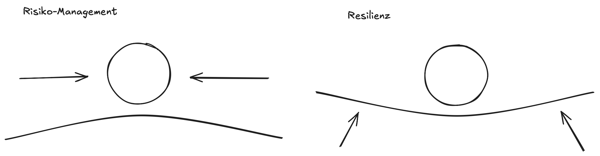

# Navigation

# Risiko-Management

|           | Wissen              | Unwissen                       |
|-----------|---------------------|--------------------------------|
| Bekannt   | Risiko-Managment    | Wird mittels Forschung kleiner |
| Unbekannt | Wissensvermittelung | Resilienz, Agilität            |

Im Risiko-Management befassen wir und mit dem Bekannten Wissen.

## Risiko-Management vs. Resilienz

|                    | Risiko-Managment                                                | Resilienz                                                          |
|--------------------|-----------------------------------------------------------------|--------------------------------------------------------------------|
| Ziel               | Kurzfristige Verluste vermeiden                                 | Wird mittels Forschung kleiner                                     |
| Ansatz             | Management-Ansatz zu bestehendem System Jährlicher Audit-Zyklus | Kontinuierlich, Evolutionär, Systematischer Ansatz                 |
| Massnahmen         | Reaktiv (aber nicht nur, sollte auch proaktiv sein), delegiert  | Antizipieren und Zukunft gestalten                                 |
| Fokus              | Schadensbegrenzung bekannter Risiken                            | Vorbereitung auf jeden unbekannten Unterbruch, anpassen und lernen |
| Verantwortlichkeit | Zugeteilte Risiko-Manager mit dedizierzten Risk-Owner           | In die Organisation eingebettet, Teil der Kultur                   |

