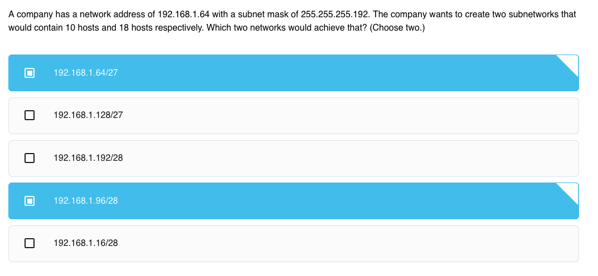

# Exam: IP Addressing

## Question 1


## Question 2



Memorize

```
128 /25
192 /26
224 /27
240 /28
248 /29
252 /30
```

## Question 3


## Question 4


## Question 5


## Question 6


## Question 7


## Question 8

## Question 9

## Question 10

## Question 11

## Question 12

## Question 13

## Question 14

## Question 15

## Question 16

## Question 17

## Question 18

## Question 19

## Question 20

## Question 21

## Question 22

## Question 23

## Question 24

## Question 25

## Question 26

## Question 27

## Question 28

## Question 29

## Question 30

## Question 31

## Question 32