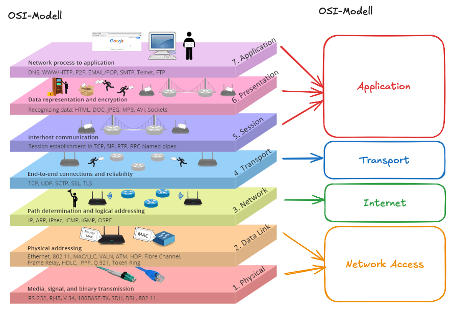
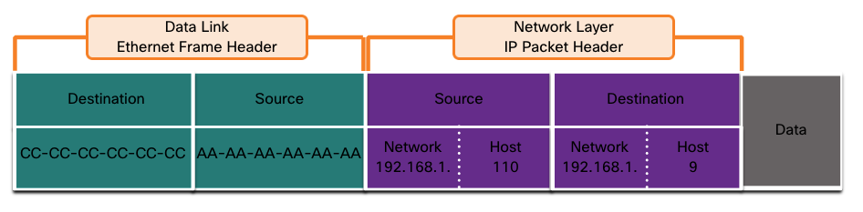

# Navigation

# Rules (Protocols)

- Message source (sender)
- Message destination (reciever)
- Channel (media that provides the pathway for the message to travel)

## Rule Establishment

Protocols require following elements to successfully send a message that is understood by the reciever:

- An identified sender and reciever
- Common language and grammer
- Speed and timing of delivery
- Confirmation or acknowledgement of requirements

## Network Protocol Requirements

| Requirement                  | Purpose                                                                                                      |
|------------------------------|--------------------------------------------------------------------------------------------------------------|
| Encoding                     | The process of coverting information into an acceptable form for transmission                                |
| Formatting and Encapsulation | Must use a specific format or structure for the type of message and channel being used                       |
| Size                         | Messages are broken into parts that have rules so they can be interpreted correctly                          |
| Timing                       | Flow Control to manage the rate, Response Timeout to know how long to wait before retrying and Access Method |
| Delivery Options             | Unicast, Multicast and Unicast                                                                               |

# Protocols

## Types of Protocols

Network Communication protocols

- Enable two or more devices to communicate over one or more networks
- TCP
- HTTP
- IP

Network Security Protocols

- Secure data to provide data integrity, authentication and encryption
- SSH
- SSL
- TLS

Routing Protocols

- Enable Routers to exchange route information, compare path information to select the best path
- OSPF (Open Shortest Path First)
- BGP

Service Discovery Protocols

- Used for the automatic detection of devices or services
- DHCP (Dynamic Host Configuration Protocol)
- DNS (Domain Name System)

## Protocol Functions

| Function              | Description                                                                                                |
|-----------------------|------------------------------------------------------------------------------------------------------------|
| Addressing            | Identifies the sender and reciever using an addressing scheme (IPv4, IPv6)                                 |
| Reliability           | Guarantees delivery (TCP)                                                                                  |
| Flow Control          | Ensures data flows at an efficient rate (TCP)                                                              |
| Sequencing            | Uniquely labels transmitted segments of data that can be used to reassable the information correctly (TCP) |
| Error Detection       | Used to determine if data has become corrupted (IPv4, IPv6, TCP)                                           |
| Application Interface | Contains information for process-to-process communications between apps (HTTP, HTTPS)                      |

# Protocol Suites 

# Data Encapsulation

## Segmenting Messages

Segmenting is the process of breaking up messages into smaller units

- Large amounts of data can be sent over the network without tying up a link which increases speed
- Only segments that fail to reach the destination need to be retransmitted which increases efficiency
- Multiplexing is the process of taking multiple streams of segmented data and weaving them together
- Sequencing is the process of numbering of data segments so they can be reassebled at the destination (ex: TCP)

## Protocol Data Units

Encapsulation is the process where protocols add their information to the data. At each stage of the process a PDU (Protocol Data Unit) has different names to reflect the new functions. 
They are reflected with the following names in the TCP/IP Suite:

1. Data (Data Stream)
2. Segment
3. Packet
4. Frame
5. Bits (Bit Stream)

# Data Access 

## Addresses

- Network layer source and destination addresses → delivers the IP packet from source to destination
- Data link layer source and destination addresses → delivers the data link frame from one NIC to anther NIC

Each Layer:

- Physical → Timing and synchronization bits
- Data Link → Destination and source addresses
- Network → Destination and source logical network addresses
- Transport → Destination and source process number (ports)
- Upper Layers → Encoded application data

## Layer 3 Logical Address

The IP packet contains two IP addresses:

- Source IP address
- Destination IP address

An IP address contains two parts:

- Network portion (IPv4) or Prefix (IPv6) → Addresses within the same network will have the same network portion
- Host portion (IPv4) or Interface ID (IPv6) → This portion is unique for every device in a network

| Layer                    | What it does                                                        |
|--------------------------|---------------------------------------------------------------------|
| L3 IP                    | Finds the next hop (logical path)                                   |
| L2 (Ethernet, PPP, etc.) | Actually delivers the packet to the next hop over the physical link |
| Encapsulation            | Binds the logical (IP) world to the physical world (Hardware)       |

NICs (Network Interface Cards) transmit the actual packets but don't understand L3. They need a destination MAC for arp to work.

- Every Layer 3 packet must be encapsulated in a Layer 2 frame for transmission
- Each hop de-encapsulates and re-encapsulates the packet as it moves along it's path

From NIC to NIC Layer 2 is de-encapsulated and rencapsulated