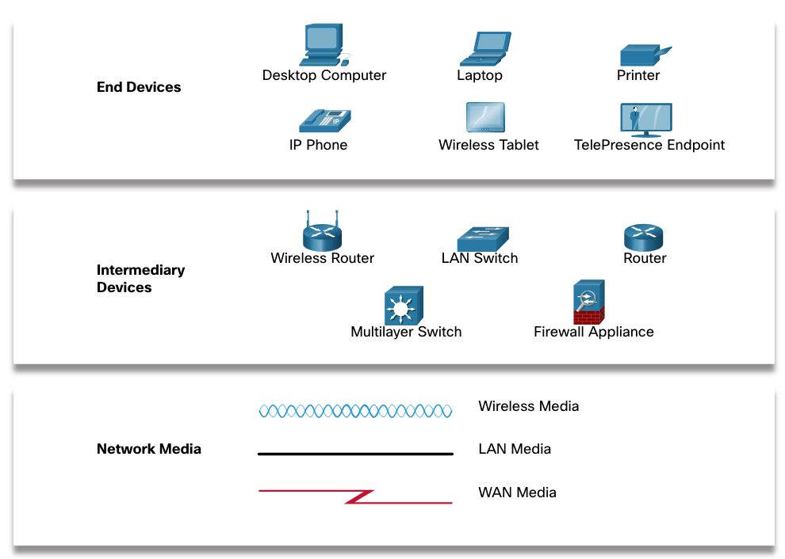
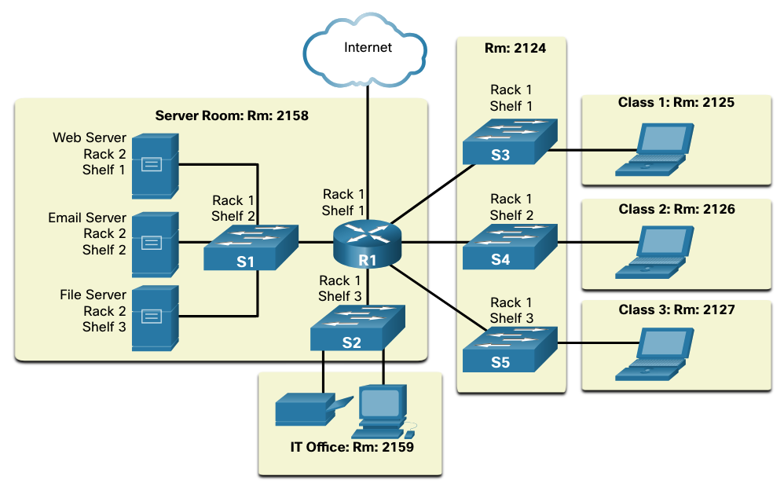
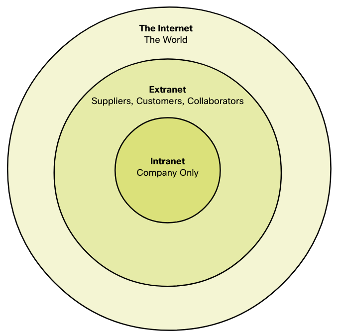
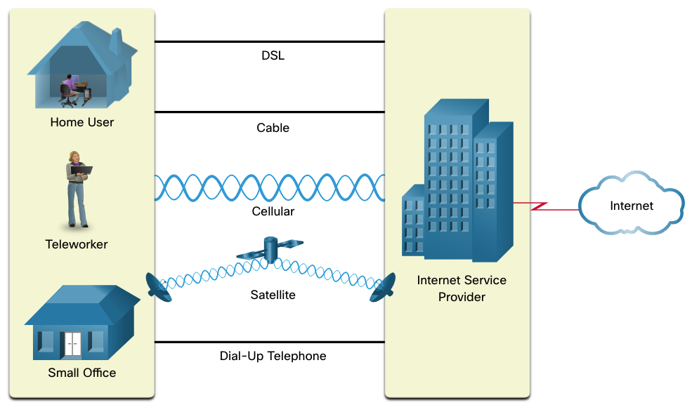

# Navigation

- [Network Componants](#network-componants)
    - [Host Rules](#host-rules)
    - [Peer-to-Peer](#peer-to-peer)
    - [End Devices](#end-devices)
- [Network Representations and Topologies](#network-representations-and-topologies)
    - [Network Representation](#network-representations)
    - [Topology Diagrams](#topology-diagrams)

# Network Componants

## Host Roles

A host is a computer or other device such as a server, workstation, printer or any other device with network connectivity

### Roles of Hosts in a network

| **Role**                 | **Description**                                                                                                                              | **Examples**                                      |
| ------------------------ | -------------------------------------------------------------------------------------------------------------------------------------------- | ------------------------------------------------- |
| **Client**               | Requests services or resources from other hosts.                                                                                             | Web browser on a PC, smartphone app, workstation. |
| **Server**               | Provides services or resources to clients.                                                                                                   | Web server, file server, DNS server.              |
| **Peer**                 | Acts as both client and server in peer-to-peer communication.                                                                                | Computers in a P2P file-sharing network.          |
| **Router / Gateway**     | Directs traffic between different networks.                                                                                                  | Home router, core network router.                 |
| **Switch / Hub**         | Connects multiple hosts within the same network segment (not always considered “hosts,” since they usually don’t have IPs for data traffic). | Network switch in an office LAN.                  |
| **Printer / IoT Device** | Specialized hosts that provide specific functions.                                                                                           | Network printer, smart TV, camera.                |

## Peer-to-Peer

Client and server software usually run on seperate computers, but it is possible for a computer to be used for both roles. Networks that work in such a principle are called peer-to-peer networks.

### Advantages and Disadvantages of Peer-to-Peer

| **Advantage**                   | **Disadvantage**                        |
|---------------------------------|-----------------------------------------|
| Easy to set up                  | No centralized administration           |
| Less complex                    | Not as secure                           |
| Lower cost because less devices | Not as scalable                         |
| Can be used for simple tasks    | Slows performance of individual devices |

## End Devices

An end device is either the source or destination of a message transmitted over the network

## Intermediate Devices

Intermediate devices connect the individual end devices to the network. They can also connect multiple networks to form an internetwork. Here's a list of such devices:

- Router
- LAN Switch
- Firewall Appliance
- Multilayer Switch

These devices perform some or all of these functions:

- Regenerate and retransmit communication signals
- Maintain information about what pathways exist through the network and internetwork
- Notify other devices of errors and communication failures
- Direct data along alternate pathways when there is a link failure
- Classify and direct messages according to priorities
- Permit or deny the flow of data, based on security settings

## Network Media

Communication transmits accross a network on media. Modern networks primarliy use three types of media to connect devices:

- Copper
- Fibre-optic
- Wireless

The main criteria for choosing network media are:

- What is the maximum distance that the media can successfully carry a signal?
- What is the environment in which the media will be installed?
- What is the amount of data and at which speed will it be transmitted?
- What is the cost of the media and installation?

# Network Representations and Topologies

## Network Representations

Network architects and administrators must be able to show what their networks will look like. They need to be able to see which components connect to other components, where they will be located, and how they will be connected. Diagrams of netwoks symbols like the ones shown in the following figure.

Specialized terminology is used to describe how each of theser devices and media connect to eachother:

- Network Interface Card (NIC) - A NIC physically connects the end device to the network
- Physical Port - A connector our outlet on a networking devices where the media connects to an end device
- Interface - Specialized ports on a networking device that connect to individual networks (the ports on a router are called network interfaces)

## Topology Diagrams

A visial map of how the network is connected. There are two types of topology diagrams: physical and logical

### Physical Topology Diagrams

Illustrate the physical location of intermediary devices and cable installation. 

### Logical Topology Diagrams

Illustrate devices, ports and the addressing scheme of the network.

# Common Types of Networks

## LANs and WANs

Network infrastructures vary greatly in terms of 

- Size of the area covered
- Number of users connected
- Number and types of services available
- Area of responsability

### LAN

A network infrastructure that spans a small geographical area. LANs have specific characteristics:

- LANs interconnect end devices in a limited area
- Usually administered by a single organisation or individual
- Administrative control is enforced at the network level and governs the security and access control policies
- LANs provide high-speed bandwidth to internal end devices and intermediary devices

### WAN

WANs interconnect LANs and have a wide geograhical area. WANs are typically managed by service providers (SPs) or Internet Service Providers (ISPs). WANs have specific characteristics:

- Interconnect LANs over wide geographical areas such as cities, states, provinces, etc.
- Are usually administered by multiple service providers
- WANS typically provide slower speed links between individual LANs

## The Internet

The internet is a collection of interconnected networks. The internet is not owned by an individual group. Ensuring effective communication across diverse infrastructure requires the application of consistent and commonly recognized technologies and standards as well as the cooperation of many network administration agencies. Some of these are as follows:

- Internet Engineering Task Force (IETF)
- Internet Corporation for Assigned Names and Numbers (ICANN)
- Internet Architecture Board (IAB)

## Intranets and Extranets

Intranet is used to refer to a private connection of LANs and WANs that belong to an organisation. An intranet is designed to be accessible only by the organisation membersm employees or others with authorization.  An organisation may use an extranet to provide secure and safe access for individuals that work for a different organisation but require access to the organisations data.

# Internet Connections

## Home and Small Office Internet Connections

- Cable - Typically offered by cable television service providers, uses the same cable as television and provides high-badnwidth, high availablity and always-on connection
- DSL -  Digital Subscriber Line provides high-badnwidth, high availablity and always-on connection. Homes and small offices usually use Asymmetrical DSL (ADSL) which means high download and lower upload.
- Cellular - Uses the phone network
- Satelite - Uses satelites and is of benefit to areas that otherwise have no internet
- Dial-up Telephone - Uses any phone line and modem and has low bandwidth

## Businesses Internet Connections

- Dedicated Leased Line - Leased lines are reserved circuits within the service providers network that connect geographically seperated offices for private data networking
- Metro Ethernet - Also called Ethernet WAN, it extends the LAN access technology into the WAN
- Business DSL - Usually Symmetric DSL (SDSL) uploads and downloads at the same speeds
- Satelite -  When there is no alternative

## The Converging Network

Today, the separate data, telephone, and video networks converge. Unlike dedicated networks, converged networks are capable of delivering data, voice, and video between many different types of devices over the same network infrastructure. This network infrastructure uses the same set of rules, agreements, and implementation standards. Converged data networks carry multiple services on one network.