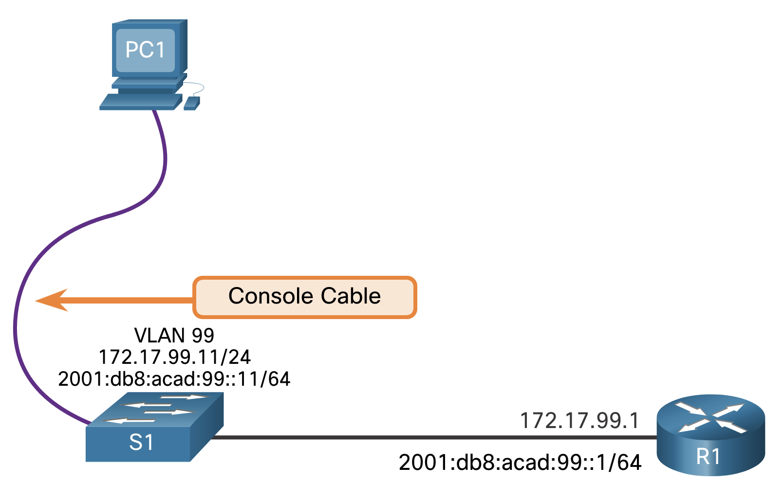

# Basic Device Configuration

## Configure a Switch with Initial Settings

### Switch a Boot Sequence

After a Cisco switch is powered in, it goes through the following five-step boot sequence:

1. First the switch loads a power-on self-test (POST) program stored in ROM. POST checks the CPU subsystem. It tests the CPU, DRAM, and the portion of the flash device that makes up the flash file system.
2. Next, the switch loads the boot loader software. The boot loader is a small program stored in ROM that is run immediately after POST successfully completes.
3. The boot loader performs low-level CPU initialization. It initializes the CPU registers, which control where physical memory is mapped, the quanitity of memory, and its speed.
4. The boot loader initializes the flash file system on the system board.
5. Finally, the boot loader locates and lods a default IOS operating system software image into memory and gives controk of the switch over to the IOS.

### The boot system Command

The switch attempts to automatically boot using information in the BOOT environment variable. If this variable is not set, the switch attempts to load and execute the first executable file it can find. The IOS operating system then initializes the interfaces using the Cisco IOS commands found in the startup-config file. The startup-config file is called config.text and is located in flash.

In the example, the BOOT environment variable is set using the boot system global configuration mode command. Notice that the IOS is located in a distinct folder and the folder path is specified. Use the command show boot to see what the current IOS boot file is set to.

```bash
boot system flash:/<name>/<name>.bin
```

### Switch LED Indicators

Cisco Catalyst switches have several status LED indicator lights. You can use the switch LEDs to quickly monitor switch activity and performance. Switches of different models and feature sets will have different LEDs and their placement on the front panel of the switch may also vary.

The following list describes each LED and what they're for

- SYST (System LED)
    - Shows whether the system is receiving power and is functioning properly. If the LED is off, it means the system is not powered on. If the LED is green, the system is operating normally. If the LED is amber, the system is receiving power but is not functioning properly.
- RPS (Redundant Power System LED)
    - Shows the RPS status. If the LED is off, the RPS is off, or it is not properly connected. If the LED is green, the RPS is connected and ready to provide backup power. If the LED is blinking green, the RPS is connected but is unavailable because it is providing power to another device. If the LED is amber, the RPS is in standby mode, or in a fault condition. If the LED is blinking amber, the internal power supply in the switch has failed, and the RPS is providing power.
- STAT (Port Status LED)
    - Indicates that the port status mode is selected when the LED is green. This is the default mode. When selected, the port LEDs will display colors with different meanings. If the LED is off, there is no link, or the port was administratively shut down. If the LED is green, a link is present. If the LED is blinking green, there is activity and the port is sending or receiving data. If the LED is alternating green-amber, there is a link fault. If the LED is amber, the port is blocked to ensure that a loop does not exist in the forwarding domain and is not forwarding data (typically, ports will remain in this state for the first 30 seconds after being activated). If the LED is blinking amber, the port is blocked to prevent a possible loop in the forwarding domain.
- DUPLEX (Port Duplex LED)
    - Indicates that the port duplex mode is selected when the LED is green. When selected, port LEDs that are off are in half-duplex mode. If the port LED is green, the port is in full-duplex mode.
- SPEED
    - Indicates that the port speed mode is selected. When selected, the port LEDs will display colors with different meanings. If the LED is off, the port is operating at 10 Mbps. If the LED is green, the port is operating at 100 Mbps. If the LED is blinking green, the port is operating at 1000 Mbps.
- PoE (Power over Ethernet Mode LED)
    - If PoE is supported, a PoE mode LED will be present. If the LED is off, it indicates the PoE mode is not selected and that none of the ports have been denied power or placed in a fault condition. If the LED is blinking amber, the PoE mode is not selected but at least one of the ports has been denied power or has a PoE fault. If the LED is green, it indicates the PoE mode is selected and the port LEDs will display colors with different meanings. If the port LED is off, the PoE is off. If the port LED is green, the PoE is on. If the port LED is alternating green-amber, PoE is denied because providing power to the powered device will exceed the switch power capacity. If the LED is blinking amber, PoE is off because of a fault. If the LED is amber, PoE for the port has been disabled.

### Recovering from a System Crash

The boot loader provides access into the switch if the operating system cannot be used because of missing or damaged system files. The boot loader has a command-line that provides access to the files stored in flash memory.

The boot loader can be accessed through a console connection following these steps:

1. Connect a PC by console cable to the switch console port. Configure terminal emulation software to connect to the switch.
2. Unplug the switch power cord.
3. Reconnect the power cord to the switch and, within 15 seconds, press and hold  down the the Mode button while the System LED i still flashing green.
4. Continue pressing the Mode button until the System LED turns briefly amber and then solid green; then release the Mode button.
5. The boot loader switch: prompt appears in the terminal emulation software on the PC.

By default, the switch attempts to automatically boot up by using information in the BOOT environment variable. To view the path of the switch BOOT environment variable type the set commands. Then, initialize the flash file system using the flash_init command to view the current files in flash.

### Switch Management Access

To prepare a switch for remote management access, the switch must have a switch virtual interface (SVI) configured with an IPv4 address and subnet mask or an IPv6 address and a prefix length for IPv6. The SVI is a virtual interface, not a physical port on the switch. Keep in mind that to manage the switch from a remote network, the switch must be configured with a default gateway. This is very similar to configuring the IP address information on host devices.



### Switch SVI Configuration Example

By default, the switch is configured to have its management controlled through VLAN 1. All ports are assigned to VLAN 1 by default. For security purposes, it is considered a best practice to use a VLAN other than VLAN 1 for the management VLAN, such as VLAN 99 in the example.

1. Configure the Management Interface

From VLAN interface configuration mode, an IPv4 address and subnet mask is applied to the management SVI of the switch. Specifically, SVI VLAN 99 will be assigned the 172.17.99.11/24 IPv4 address and the 2001:db8:acad:99::1/64 IPv6 address as shown.

Note: The SVI for VLAN 99 will not appear as “up/up” until VLAN 99 is created and there is a device connected to a switch port associated with VLAN 99.

Note: The switch may need to be configured for IPv6. For example, before you can configure IPv6 addressing on a Cisco Catalyst 2960 running IOS version 15.0, you will need to enter the global configuration command sdm prefer dual-ipv4-and-ipv6 default and then reload the switch.

| Task                                            | Commands                                |
|-------------------------------------------------|-----------------------------------------|
| Enter global configuration mode                 | `configure terminal`                    |
| Enter interface configuration mode for the SVI  | `interface vlan 99`                     |
| Configure the management interface IPv4 address | `ip address 172.17.99.11 255.255.255.0` |
| Configure the management interface IPv6 address | `ipv6 address 2001:db8:acad:99::11/64`  |
| Enable the management interface                 | `no shutdown`                           |
| Return to the privileged EXEC mode              | `end`                                   |
| Save the running config to the startup config   | `copy running-config startup-config`    |

2. Configure the Default Gateway

The switch should be configured with a default gateway if it will be managed remotely from networks that are not directly connected.

Note: Because, it will receive its default gateway information from a router advertisement (RA) message, the switch does not require an IPv6 default gateway.

| Task                                            | Commands                                |
|-------------------------------------------------|-----------------------------------------|
| Enter global configuration mode                 | `configure terminal`                    |
| ip default-gateway 172.17.99.1                  | `ip default-gateway 172.17.99.1`        |
| Return to the privileged EXEC mode              | `end`                                   |
| Save the running config to the startup config   | `copy running-config startup-config`    |

3. Verify Configuration

The show ip interface brief and show ipv6 interface brief commands are useful for determining the status of both physical and virtual interfaces. The output shown confirms that interface VLAN 99 has been configured with an IPv4 and IPv6 address.

Note: An IP address applied to the SVI is only for remote management access to the switch; this does not allow the switch to route Layer 3 packets.

```bash
show ip interface brief

# Example output
Interface     IP-Address     OK? Method   Status    Protocol
Vlan99        172.17.99.11   YES manual   down      down
(output omitted)
S1# show ipv6 interface brief
Vlan99                 [down/down]
    FE80::C27B:BCFF:FEC4:A9C1
    2001:DB8:ACAD:99::11
(output omitted)
```

## Configure Switch Ports

The ports of a switch can be configured independently for different needs. This topic covers how to configure switch ports, how to verify your configurations, common errors, and how to troubleshoot switch configuration issues.

Full-duplex communication increases bandwidth efficiency by allowing both ends of a connection to transmit and receive data simultaneously. This is also known as bidirectional communication and it requires microsegmentation. A microsegmented LAN is created when a switch port has only one device connected and is operating in full-duplex mode. There is no collision domain associated with a switch port operating in full-duplex mode.

Unlike full-duplex communication, half-duplex communication is unidirectional. Half-duplex communication creates performance issues because data can flow in only one direction at a time, often resulting in collisions. Half-duplex connections are typically seen in older hardware, such as hubs. Half-duplex hubs have been replaced by switches that use full-duplex communications by default.

- Full-Duplex Communication: Send and recieve, simultaneously
- Half-Duplex Communication: Send OR receive

### Configure Switch Ports at the Physical Layer

Switch ports can be manually configured with specific duplex and speed settings. Use the duplex interface configuration mode command to manually specify the duplex mode for a switch port. Use the speed interface configuration mode command to manually specify the speed. For example, both switches in the topology should always operate in full-duplex at 100 Mbps.

| Task                                          | Commands                            |
|-----------------------------------------------|-------------------------------------|
| Enter global configuration                    | `configure terminal`                |
| Enter interface configuration mode            | `interface FastEthernet 0/1`        |
| Configure the interface duplex                | `duplex full`                       |
| Configure the interface speed                 | `speed 100`                         |
| Return to the privileged EXEC mode            | `end`                               |
| Save the running config to the startup config | `copy running-config startup-config`|

### Auto-MDIX

Until recently, certain cable types (straight-through or crossover) were required when connecting devices. Switch-to-switch or switch-to-router connections required using different Ethernet cables. Using the automatic medium-dependent interface crossover (auto-MDIX) feature on an interface eliminates this problem. When auto-MDIX is enabled, the interface automatically detects the required cable connection type (straight-through or crossover) and configures the connection appropriately. When connecting to switches without the auto-MDIX feature, straight-through cables must be used to connect to devices such as servers, workstations, or routers. Crossover cables must be used to connect to other switches or repeaters.

With auto-MDIX enabled, either type of cable can be used to connect to other devices, and the interface automatically adjusts to communicate successfully. On newer Cisco switches, the mdix auto interface configuration mode command enables the feature. When using auto-MDIX on an interface, the interface speed and duplex must be set to auto so that the feature operates correctly.

The command to enable auto-MDIX is issued in interface configuration mode on the switch as shown:

```bash
mdix auto
```

Note: The auto-MDIX feature is enabled by default on Catalyst 2960 and Catalyst 3560 switches but is not available on the older Catalyst 2950 and Catalyst 3550 switches.

To examine the auto-MDIX setting for a specific interface, use the show controllers ethernet-controller command with the phy keyword. To limit the output to lines referencing auto-MDIX, use the include MDIX filter. As shown the output indicates On or Off for the feature.

```bash
show controllers ethernet-controller fa0/1 phy | include MDIX
Auto-MDIX           :  On   [AdminState=1   Flags=0x00052248]
```

### Switch Verification Commands

The table summarizes some of the more useful switch verification commands.

| Task                                        | Commands                         |
|---------------------------------------------|----------------------------------|
| Display interface status and configuration  | `show interfaces [interface-id]` |
| Display current startup configuration       | `show startup-config`            |
| Display current running configuration       | `show running-config`            |
| Display information about flash file system | `flash`                          |
| Display system hardware and software status | `show version`                   |
| Display history of command entered          | `show history`                   |
| Display IP information about an interface   | `show ip interface`              |
| Display the MAC address table               | `show mac address-table`         |


# NETW2 Summary (from 1.2.5 onwards)

---

# 1.2.5 Verify Switch Port Configuration

## Using show running-config
- Verifies switch configuration
- Important checks:
  - Interface → VLAN assignment (e.g., Fa0/18 → VLAN 99)
  - VLAN interface (SVI) IP configuration
  - Default gateway

## Using show interfaces
- Shows:
  - Interface status (up/down)
  - Duplex & speed
  - Errors and statistics
- Key:
  - up/up = working
  - Displays full-duplex / speed (e.g., 100 Mbps)

---

# Network Access Layer Issues

## Interface Status Meaning

### Interface up / line protocol down
- Encapsulation mismatch
- Error-disabled port
- Hardware issue

### Interface down / line protocol down
- Cable unplugged
- Device off

### Administratively down
- Interface manually disabled (shutdown)

---

## Common Errors

### Input Errors
- Runts → < 64 bytes
- Giants → > 1518 bytes
- CRC errors:
  - Cable problems
  - Noise/interference
  - Loose connections

### Output Errors
- Collisions:
  - Normal in half-duplex
- Late collisions:
  - Duplex mismatch
  - Cable too long

---

## Troubleshooting Process

### Steps
1. show interfaces
2. Check status
3. If down:
   - Check cables
   - Check speed/duplex
4. If up but issues:
   - Check interference
   - Verify duplex both sides
5. Fix or escalate

---

# 1.3 Secure Remote Access

## Telnet
- TCP port 23
- Plaintext transmission
- Not secure
- Can be sniffed (e.g., Wireshark)

---

## SSH
- TCP port 22
- Encrypted communication
- Secure replacement for Telnet

---

## Verify SSH Support

### Command
show version

- IOS must contain "k9" → supports encryption

---

## Configure SSH

### Step 1 – Verify
show ip ssh

### Step 2 – Domain
ip domain-name example.com

### Step 3 – RSA Keys
crypto key generate rsa

### Step 4 – User
username admin secret password

### Step 5 – VTY Lines
line vty 0 4  
login local  
transport input ssh  

### Step 6 – SSH Version
ip ssh version 2

---

## Verify SSH

### Commands
show ip ssh  
show ssh  

---

# 1.4 Basic Router Configuration

## Basic Setup

### Hostname
hostname R1

### Passwords
enable secret class  

line console 0  
password cisco  
login  

line vty 0 4  
password cisco  
login  

### Encryption
service password-encryption

---

## Banner
banner motd Authorized Access Only!

---

## Save Configuration
copy running-config startup-config

---

## Configure Interfaces

### Requirements
- Must have IP address
- Must be enabled (no shutdown)
- Must be connected

### Example
interface gigabitEthernet 0/0/0  
ip address 192.168.1.1 255.255.255.0  
no shutdown  

---

## Interface Description
description Link to LAN

---

## Loopback Interface
- Virtual interface (always up)
- Used for testing/simulation

### Example
interface loopback 0  
ip address 1.1.1.1 255.255.255.255  

---

# 1.5 Verify Directly Connected Networks

## Useful Commands

### Interface Summary
show ip interface brief  
show ipv6 interface brief  

### Interface Config
show running-config interface <interface>

### Routing Table
show ip route  
show ipv6 route  

---

## Interface Status

### Working
- up/up → OK

### Not Working
- Anything else:
  - Config issue
  - Cabling issue

---

## IPv6 Addresses

### Types
- Global unicast → manually configured
- Link-local → auto (FE80)
- Multicast → FF02

---

## Routing Table Entries

### Codes
- C → connected network
- L → local route

### Masks
- IPv4 → /32
- IPv6 → /128

---

## Filter Output

### Syntax
show running-config | include vlan

### Options
- include
- exclude
- begin
- section

---

## Command History

### Navigation
- Up arrow / Ctrl+P → previous
- Down arrow / Ctrl+N → next

### Show History
show history

### Change Size
terminal history size 50