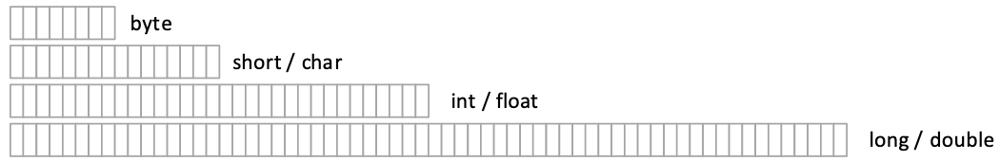
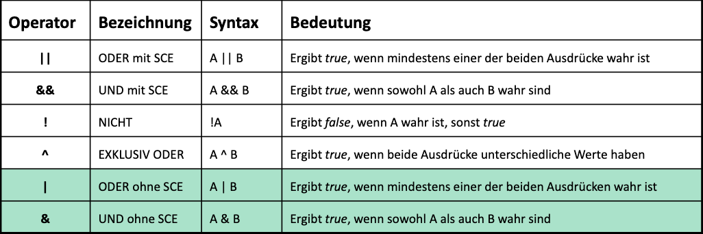
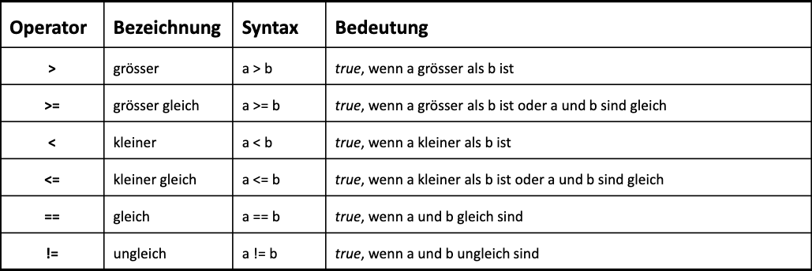
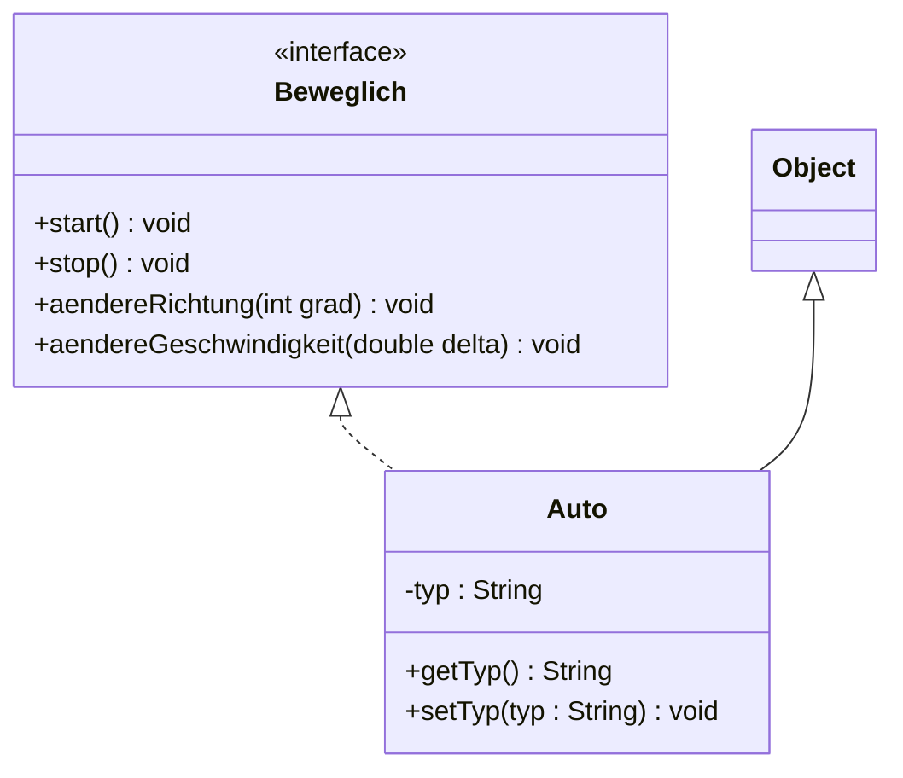
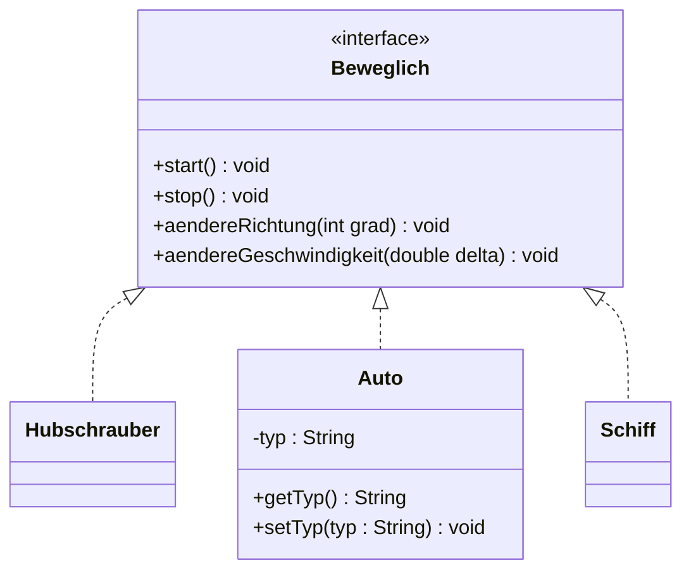
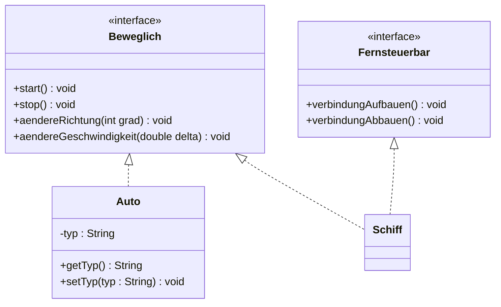
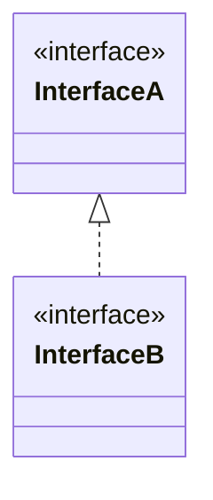
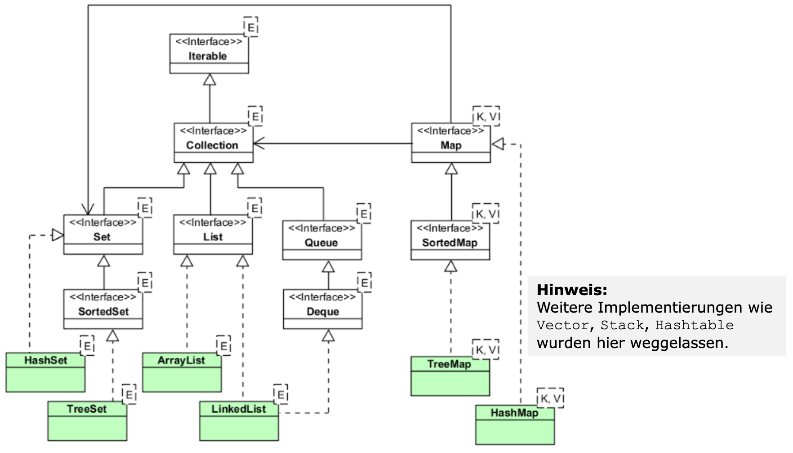
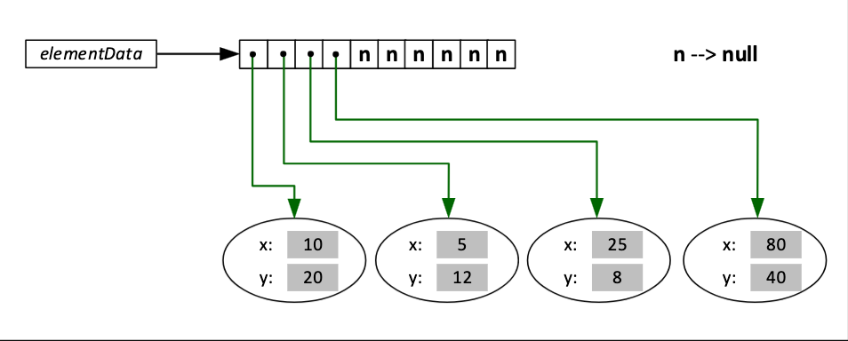
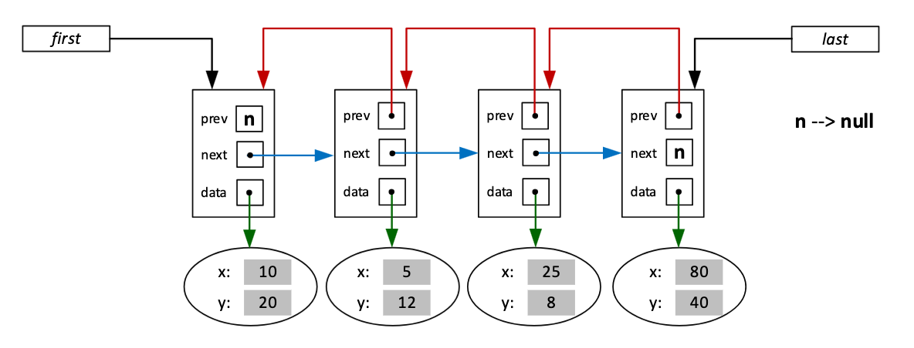

# Java Basics

<!-- vscode-markdown-toc -->
* 1. [Zeichen](#Zeichen)
* 2. [Kommentare](#Kommentare)
* 3. [Konstanten](#Konstanten)
* 4. [Datentypen in Java](#DatentypeninJava)
	* 4.1. [Wertebereich (Byte)](#WertebereichByte)
* 5. [Arithmetische Operatoren](#ArithmetischeOperatoren)
* 6. [Logische Operatoren](#LogischeOperatoren)
* 7. [Relationale Operatoren](#RelationaleOperatoren)
* 8. [Typumwandelung (Typecast)](#TypumwandelungTypecast)
* 9. [Auswertungsreihenfolge & Assoziativitätsregeln](#AuswertungsreihenfolgeAssoziativittsregeln)
	* 9.1. [Assoziativität](#Assoziativitt)
	* 9.2. [Reihenfolge](#Reihenfolge)
* 10. [Arrays](#Arrays)
	* 10.1. [Speicher Referenzierung und Arrays](#SpeicherReferenzierungundArrays)
	* 10.2. [Mehrdimensionale Arrays](#MehrdimensionaleArrays)
* 11. [Kontrollstrukturen](#Kontrollstrukturen)
	* 11.1. [Sequenz](#Sequenz)
	* 11.2. [Selektion](#Selektion)
	* 11.3. [Iteration](#Iteration)
* 12. [Sprunganweisungen](#Sprunganweisungen)
* 13. [Klassen als strukturierter Datentyp](#KlassenalsstrukturierterDatentyp)
* 14. [Objekte](#Objekte)
* 15. [Methoden](#Methoden)
	* 15.1. [Kassenmethode](#Kassenmethode)
	* 15.2. [Objekt- oder Instanz-methode](#Objekt-oderInstanz-methode)
* 16. [Objektorientierte Programmierung (OOP)](#ObjektorientierteProgrammierungOOP)
	* 16.1. [Objekte Beispiele:](#ObjekteBeispiele:)
	* 16.2. [Vorgehen](#Vorgehen)
	* 16.3. [Beispiel Aufgabe](#BeispielAufgabe)
	* 16.4. [Domain-Klassen](#Domain-Klassen)
	* 16.5. [Business-Klassen](#Business-Klassen)
	* 16.6. [Erstellung von Objekten (Konstruktoren)](#ErstellungvonObjektenKonstruktoren)
		* 16.6.1. [Parameterloser Konstruktor (Standard)](#ParameterloserKonstruktorStandard)
		* 16.6.2. [Private Datenfelder und Methoden](#PrivateDatenfelderundMethoden)
		* 16.6.3. [Parametrisierter Konstruktor (Benutzerdefinierter-Konstruktor)](#ParametrisierterKonstruktorBenutzerdefinierter-Konstruktor)
		* 16.6.4. [Aufruf eines Konstruktors im Konstruktor](#AufrufeinesKonstruktorsimKonstruktor)
	* 16.7. [Klassen und Instanzmethoden (Objektmethoden)](#KlassenundInstanzmethodenObjektmethoden)
	* 16.8. [Klassen- und Instanzvariablen (Objektvariablen)](#Klassen-undInstanzvariablenObjektvariablen)
		* 16.8.1. [Instanzvariablen / Objektvariablen](#InstanzvariablenObjektvariablen)
		* 16.8.2. [Referenz-Typ](#Referenz-Typ)
* 17. [Vererbung](#Vererbung)
	* 17.1. [Super- und Subklassen](#Super-undSubklassen)
	* 17.2. [Generalisierung vs. Spezialisierung](#Generalisierungvs.Spezialisierung)
	* 17.3. [Vererbung in Java](#VererbunginJava)
	* 17.4. [java.lang.Object](#java.lang.Object)
* 18. [Methoden Überschreiben](#Methodenberschreiben)
* 19. [Konstruktoren in Unterklassen](#KonstruktoreninUnterklassen)
* 20. [Typumwandelung (Type Cast) bei Referenzen](#TypumwandelungTypeCastbeiReferenzen)
	* 20.1. [Statischer vs. dynamischer Typ](#Statischervs.dynamischerTyp)
* 21. [Abstrakte Basisclassen](#AbstrakteBasisclassen)
* 22. [Polymorphie](#Polymorphie)
	* 22.1. [Polymorphie von Methoden](#PolymorphievonMethoden)
	* 22.2. [Überschreiben von Methoden](#berschreibenvonMethoden)
	* 22.3. [Polymorphie von Objekten](#PolymorphievonObjekten)
	* 22.4. [Polymorphie von Klassen (Generics)](#PolymorphievonKlassenGenerics)
* 23. [Spezifikation vs Implementierung](#SpezifikationvsImplementierung)
* 24. [Schnittstellen (Interfaces) in Java](#SchnittstellenInterfacesinJava)
	* 24.1. [Interface zu Klassen beziehung](#InterfacezuKlassenbeziehung)
	* 24.2. [Mehrere Klassen implementieren eine Schnittstelle](#MehrereKlassenimplementiereneineSchnittstelle)
	* 24.3. [Eine Klasse implementiert mehrere Interfaces](#EineKlasseimplementiertmehrereInterfaces)
	* 24.4. [Schnittstellen Vererbung](#SchnittstellenVererbung)
	* 24.5. [Verwendung von Schnittstellen](#VerwendungvonSchnittstellen)
* 25. [Vergleichen von Referenztypen](#VergleichenvonReferenztypen)
	* 25.1. [Methode Object.equals](#MethodeObject.equals)
	* 25.2. [Methode Object.hashCode](#MethodeObject.hashCode)
	* 25.3. [Schnittstelle java.lang.Comparable](#Schnittstellejava.lang.Comparable)

<!-- vscode-markdown-toc-config
	numbering=true
	autoSave=true
	/vscode-markdown-toc-config -->
<!-- /vscode-markdown-toc -->

##  1. <a name='Zeichen'></a>Zeichen

Zeichenvorrat: ASCII und ISO-Latin-1 (ISO 8859-1)
Zeichensatz: Unicode mit Format UTF-16 (2 Bytes oder 4 Bytes pro Zeichen)

##  2. <a name='Kommentare'></a>Kommentare

Einzeilige Kommentare:

```java
// This is an inline comment
```

Mehrzeilige Kommentare:

```java
/*
    This is a comment block
*/
```

Dokumentationslommentare:

```java
/**
*   This a documentation comment in java
*/
```

##  3. <a name='Konstanten'></a>Konstanten

Symbolische Konstante:

```java
final int MINIMUM = 10;
```

Literale Konstante:

```java
double endZahl = 10;
```

##  4. <a name='DatentypeninJava'></a>Datentypen in Java



###  4.1. <a name='WertebereichByte'></a>Wertebereich (Byte)

- 8 Bits bedeutet 2^8 = 256 Kombinationen von 1 und 0
- Dies wird für den Positiven und Negativen Bereich halbiert (128 Kombinationen)
- Null wird dem positiven Bereich zugeteil (-128 bis +127)

##  5. <a name='ArithmetischeOperatoren'></a>Arithmetische Operatoren


##  6. <a name='LogischeOperatoren'></a>Logische Operatoren



##  7. <a name='RelationaleOperatoren'></a>Relationale Operatoren



##  8. <a name='TypumwandelungTypecast'></a>Typumwandelung (Typecast)

Implizite Typumwandlung: (Implizit nur wenn von einem "engeren" Typ zu einem "breiteren")

```java
public class ImplicitCastExample {
    public static void main(String[] args) {
        int x = 10;
        double y = x; // implicit cast from int to double

        System.out.println("x = " + x); // 10
        System.out.println("y = " + y); // 10.0
    }
}
```

Explizite Typumwandelung: (Muss verwendet werden wenn)

```java
public class ExplicitCastExample {
    public static void main(String[] args) {
        double a = 9.7;
        int b = (int) a; // explicit cast from double to int

        System.out.println("a = " + a); // 9.7
        System.out.println("b = " + b); // 9 (decimal part is cut off)
    }
}
```


##  9. <a name='AuswertungsreihenfolgeAssoziativittsregeln'></a>Auswertungsreihenfolge & Assoziativitätsregeln

###  9.1. <a name='Assoziativitt'></a>Assoziativität

- linksassoziaztive Operatoren
    - Prä- und Postfix-Inkrement und -Dekrement (++a, a++, --a, a--)
    - Vorzeichen
    - Logisches Nicht (Negation)
    - Typumwandelung (Type Casting)
    - Bedingungsoperator (?)
    - Zuweisungen

- rechtsassoziative Operatoren
    - alle anderen Operatoren

###  9.2. <a name='Reihenfolge'></a>Reihenfolge

1. Indexoperator, Methodenaufruf, Komponentenzugriff
2. Prä- und Postfix-Inkrement und -Dekrement, Vorzeichen, logisches Nicht
3. Typecast
4. Multiplikation, Division, Restwert
5. Addition, Subtraktion, Stringverkettung (Concat)
6. ...
13. ...
14. Zuweisungen

##  10. <a name='Arrays'></a>Arrays

Deklaration: `Datentyp[] Variablenname;``

```java
String[] kantone = null;
```

Speicher-Reservierung: `Variablenname = new Datentyp[Anzahl Elemente];``

```java
gemeinden = new String[32];
```

Die Deklaration und Speicherreservierung kann auch in einem Schritt gemacht werden:

```java
String[] gemeinden = new String[32];
```

Erstellung eines Arrays ohne new-Operator:

```java
String[] gemeinden = {Bern, ..., Zurich};
```

Zugriff auf Arrayelemente über den Index: `Arraynamen[Indexwert]``

```java
String firstKanton = gemeinden[0]; // firstKanton equals Bern
```

###  10.1. <a name='SpeicherReferenzierungundArrays'></a>Speicher Referenzierung und Arrays

Wenn ein Array einem Array zugewiesen wird, wird keine Kopie erstellt, sondern es zeigen beide Arrays auf den gleichen Speicher.

```java
int[] arrA = {1, 3, 5, 7, 9};
int[] arrB = arrA;
```

Die Array kann folgendermassen kopiert werden:

```java
int[] arrA = {1, 3, 5, 7, 9};
int[] arrB = new int[arrA.length]

for (int i = 0; i < arrA.length; i++) {
    arrB[i] = arrA[i];
}
```

###  10.2. <a name='MehrdimensionaleArrays'></a>Mehrdimensionale Arrays

Java kennt auch zweidimensionale und dreidimensionale Arrays. Folgend ein Beispiel eines zweidimensionalen Arrays:

```java
int anzZeilen = 5;
int anzSpalten = 3;

int[][] tabelle = new int[anzZeilen][anzSpalten];

// Element in erster Zeile und zweiter Spalte setzen
tabelle[0][1] = 3;
```

##  11. <a name='Kontrollstrukturen'></a>Kontrollstrukturen

- Sequenz: Abfolge von Befehlen
- Selektion: Verzweigun
- Iteration: Schleifen

###  11.1. <a name='Sequenz'></a>Sequenz

```java
double a = 99;
double b = 10;
double resultat = a / b;
System.out.println("Resultat: " + resultat);
```

###  11.2. <a name='Selektion'></a>Selektion

If Else Selektion:

```java
int x = (int)(Math.random() * 100);
if (x < 50) {
    System.out.println("Die zufällige Zahl ist grösser als 50");
} else if (x == 50) {
    System.out.println("Die zufällige Zahl ist gleich 50");
} else {
    System.out.println("Die zufällige Zahl ist kleiner als 50");
}
```

Switch

```java
Scanner sc = new Scanner(System.in);
System.out.println("Bitte eine Zahl zwischen 1-2 eingeben: ");
int nummer = sc.nextInt();

switch (nummer) {
    case 1:
        System.out.println("Die Zahl " + nummer + " wurde eingegeben");
        break;
    case 2:
        System.out.println("Die Zahl " + nummer + " wurde eingegeben");
        break;
    default:
        System.out.println("Fehlerhafter Wert!");
}
```

###  11.3. <a name='Iteration'></a>Iteration

For-Schlaufen:

```java
for (int i = 0; i < 5; i++) {
    System.out.print("Quadrat: " + (i * i));
}
```

Beispiel mit einem Array:

```java
String[] jahreszeiten = {"Fruehling", "Sommer", "Herbst", "Winter"};

for (String element : jahreszeiten) {
    System.out.println(element);
}
```

While-Schlaufen:

```java
int a = 10;

while (a > 0) {
    System.out.println("a = " + a);
    a--;
}
```

Do-While-Schlaufe:

```java
Scanner sc = new Scanner(System.in);

int wahl = -1, n = 0;

do {
    System.out.println("Quadrat berechnen [1]   Beenden [0]");
    System.out.print("Ihre Wahl: ");
    wahl = sc.nextInt();

    if (wahl != 0) {
        System.out.print("\nGanze Zahl eingeben: ");
        n = sc.nextInt();
        System.out.println(n + " * " + n + " = " + (n * n) + "\n");
    }
} while (wahl != 0);
```

##  12. <a name='Sprunganweisungen'></a>Sprunganweisungen

Break:

```java
Integer[] arr = new Integer[10];
arr[0] = 1;
arr[1] = 2;
arr[2] = 3;
arr[4] = 4;

for (int i = 0; i < arr.length; i++) {
    if (arr[i] == null) {
        break;
    }
    System.out.print(arr[i]);
// Prints 123 because arr[3] is null
}
```

Continue:

```java
Integer[] arr = new Integer[10];
arr[0] = 1;
arr[1] = 2;
arr[2] = 3;
arr[4] = 4;

for (int i = 0; i < arr.length; i++) {
    if (arr[i] == null) {
        continue;
    }
    System.out.print(arr[i]);
// Prints 1234 because continue doesn't stop at arr[3] which is null
}
```

##  13. <a name='KlassenalsstrukturierterDatentyp'></a>Klassen als strukturierter Datentyp

- Elementare (primitive) Datentypen sind atomar und können nicht weiter zerlegt werden
- Strukturierte Datentypen packen zusammen was logisch zusammen gehört
- Beispiele strukturierte Daten: Punkt(x,y), Datum(Jahr, Monat, Tag), ...

Raum als strukturierter Typ in Java:

```java
class Raum {
    String raumBezeichnung;
    int anzahlPlaetze;
    boolean klimatisiert;
}
```

##  14. <a name='Objekte'></a>Objekte

Objekte werden mit Hilfe der Mutter-Klasse erstellt, wobei die Klasse als Vorlage dient. Ein Objekt ist eine konkrete Ausprägung / Instanz einer Klasse.

```java
// Syntax Objekt erstellen
DATENTPY < REFERENZVAIABLE > = new < KLASSENNAME >();
```
Beispiel mit der Klasse Raum:

```java
Raum raum322 = new Raum();
```

Der Zugriff auf Komponente eines Objekts funktioniert folgendermassen:

```java
raum322.anzahlPlaetze = 35;
```

##  15. <a name='Methoden'></a>Methoden

Eine Methode besteht aus Anweisungen, die zwecks Lösung einer Aufgabe zusammengefasst und mit einem aussagekräftigen Namen versehen wurden. Eine Methode kann an einer beliebigen Stelle im Programm über den Namen der Methode aufgerufen werden.

```java
// Syntax Methode
< MODIFIKATOR(EN) > < RUECKGABEWERT_TYP > < METHODENNAME > (< PARAMETERLISTE >) {
// Implementierung (Methodenrumpf) …
}
```

Beispiel anhand der Methode `main`:

```java
public static void main(String[] args) {
    // Implementation
}
```

Beispiel mit einer Methode die die Summe aller Zahlen in einem vorgegebenen Bereich berechnet:

```java
public class Demo {
    public static void main(String[] args) {
        Scanner sc = new Scanner(System.in);

        System.out.println("Untere Grenze Eingeben: ");
        int von = sc.nextInt();

        System.out.println("Obere Grenze EIngeben: ");
        int bis = sc.nextInt();

        int summe = berechneSumme(von, bis);

        System.out.println("Summe aller Zahlen von %d bis %d ist %d\n", von, bis, summe);
    }

    public static int berechneSumme (int von, int bis) {
        int summe = 0;

        for (int i = von; i <= bis; i++) {
            summe += i;
        }
        return summe;
    }
}
```

###  15.1. <a name='Kassenmethode'></a>Kassenmethode

Eine Klassenmethode gehört einer Klasse und wird mit dem Modifikator static versehen. Mit der Math Klasse demonstriert:

```java
double resultat = Math.pow(2,10);
```

###  15.2. <a name='Objekt-oderInstanz-methode'></a>Objekt- oder Instanz-methode

Instanzmethoden haben keinen Modifikator static und können ausschliesslich über die Referenz auf eine Instanz der Klasse aufgerufen werden:

```java
Scanner keyboard = new Scanner(System.in);

int a = keyboard.nextInt();
String text = keyboard.nextLine();

System.out.println(text.toUpperCase());
int strLaenge = text.length();
```

##  16. <a name='ObjektorientierteProgrammierungOOP'></a>Objektorientierte Programmierung (OOP)

- Programme werden in Einheiten zerlegt welche Objekte genannt werden
- Methoden (Daten und Operationen) werden in Objekten zusammengefasst womit der Zugriff auf Daten eines Objekts kontrolliert werden kann (Kapselung)
- Die kleinste Struktur ist eine Klasse / Objekt

###  16.1. <a name='ObjekteBeispiele:'></a>Objekte Beispiele:

- Garage von Hr. Meier
- Das Auto mit VIN 1HGFH14JNXM901724
- Flug Zürich nach Berlin am 22.09.2025 um 09:00

###  16.2. <a name='Vorgehen'></a>Vorgehen

1. Objekte für die Problemstellung definieren
2. Objekten der realen Welt mit deren Eigenschaften, Verhalten und Beziehungen analysieren
3. Ähnliche Objekte gruppieren wodurch Klassen von Objekten entstehen
4. Eigenschaften und Verhalten der einzelnen Objekt-Typen in Einheiten zusammenfassen
→ Eine Einheit definiert einen neuen Typ / Klasse

###  16.3. <a name='BeispielAufgabe'></a>Beispiel Aufgabe

Es soll eine Applikation erstellt werden für die Verwaltung von Büchern und Regalen

| Nr | Objekt | Relevante Eigenschaften |
|----|--------|-------------------------|
| 1 | Buch | Autor, Titel, Auflage, Erscheinungsjahr, ISBN, Sprache, Status |
| 2 | Regal | Bezeichnung, Etage |
| 3 | Kunde | Name, Adresse, Email, Telefon, Kundennummer |

Eine Klasse definiert die Struktur und Verhalten einer ganzen Menge an gleichartigen Objekten und dient als Bauplan für die Erstellung von Objekten. Eine Klasse hat eine 1 - n Beziehung zu Objekten

Welche Vorgänge sind im Kontext der Aufgabe relevant?

- Neues Buch wird in der Bibliothek erfasst
- Kunde leiht eine oder mehrere Bücher aus
- Eine Ausleiehe wird verlängert
- Kunde erkündigt sich über verfügbarkeit eines Buches (per Telefon, Email, Vorort)
- Ein Buch wird zrückgebracht
- Die Bibiothek sendet eine Mahnung an einen Kunden

Welche der obigen Vorgehen sollen automatisiert werden?
Welche Klasse soll für ein konkreter Vorgang zuständig sein?


###  16.4. <a name='Domain-Klassen'></a>Domain-Klassen

- Verwalten Daten die in der Anwendung vorkommen
    - Bsp: Buch, Kunde, Ausleihe Status, Mahnung, Rechnung

- Stellen Methoden zur Verfügung mit denen der Zustand einer konkreten Instanz der Klasse geändert oder abgefragt werden kann (set und get Methoden)
    - Bsp für die Klasse Kunde: setName, setEmail, getTelefon, etc.

###  16.5. <a name='Business-Klassen'></a>Business-Klassen

- Zuständig für Businesslogik (Geschäftsprozesse)
    - Bsp: BuchManager für ausleih Prozesse

- Stellen Methoden zur Verfügung mit denen bestimmte Aktionen durchgeführt werden können
    - Bsp: ausleiheVerlängern


###  16.6. <a name='ErstellungvonObjektenKonstruktoren'></a>Erstellung von Objekten (Konstruktoren)

Bevor mit einem Objekt gearbeitet werden kann, muss das Objekt mit Hilfe des "new" Operators erstellt werden:

```java
Buch buchA = new Buch();
```

- Nach der Erstellung ist das Objekt im Speicher und kann über den Referenz "buchA" angesprochen werden
- Für jeder Komponent des Objekts (Datenfeld, Attribut), wird entsprechend Speicher reserviert und mit folgenden Standartwerten initialisiert: https://docs.oracle.com/javase/tutorial/java/nutsandbolts/datatypes.html

####  16.6.1. <a name='ParameterloserKonstruktorStandard'></a>Parameterloser Konstruktor (Standard)

Die Erstellung eines Objekts übernimmt eine spezielle Methode welcher Konstruktor heisst.

- Hat den gleichen Namen wie die Klasse
- Liefert keinen Rückgabewert
- Ist normalerweise public

Wird verwendet wenn eine Klasse keine eigene Konstruktor implementiert

####  16.6.2. <a name='PrivateDatenfelderundMethoden'></a>Private Datenfelder und Methoden

Um den Wert eines Datenfelds zu ändern muss die entsprechende set-Methode verwendet werden da alle Felder private sind (Kapselung)

```java
buchA.setTitel("Beispiel");
```

Die Summe aller Methoden, welche auf einem Objekt aufgerufen werden können, definiert das Verhalten des Objekts

####  16.6.3. <a name='ParametrisierterKonstruktorBenutzerdefinierter-Konstruktor'></a>Parametrisierter Konstruktor (Benutzerdefinierter-Konstruktor)

Um die Datenfelder eines Objekts bei der Erstellung mit benutzerdefinierten Werten zu initialisieren muss ein Konstruktor implementiert werden, der beim Aufruf die Werte entgegennehmen kann.

Eine Klasse kann mehrere Konstruktoren haben. Achtung sobald ein Konstruktor implementiert wird, wird der Standard Konstruktor automatisch entfernt.

####  16.6.4. <a name='AufrufeinesKonstruktorsimKonstruktor'></a>Aufruf eines Konstruktors im Konstruktor

In einem Konstruktor kann auch ein weiterer Konstruktor der gleichen Klasse aufgerufen werden. Der Aufruf muss zwingend in der ersten Zeile des Konstruktors erfolgen. Ein Konstruktor darf erst dann Code ausführen, wenn klar ist, welcher Konstruktor für die Initialisierung zuständig ist, daher muss der Aufruf eines anderen Konstruktors in der ersten Zeile stehen.

###  16.7. <a name='KlassenundInstanzmethodenObjektmethoden'></a>Klassen und Instanzmethoden (Objektmethoden)

Eine Klassenmethode ist eine Methode mit dem Modifikator static und kann mit dem Klassennamen aufgerufen werden

- Soll verwendet werden wenn eine Methode kein Zugriff auf die Instanzvariablen oder andere Instanzmethoden des Objekts braucht

Eine Instanzmethode ist ohne Modifikator static definiert und ist an Existenz einer Instanz der Klasse gebunden. Sie kann nicht über den Kassennamen aufgerufen werden.

- Soll verwendet werden wenn Zugriff auf die Instanzvariablen oder andere Instanzmethoden des Objekts braucht

###  16.8. <a name='Klassen-undInstanzvariablenObjektvariablen'></a>Klassen- und Instanzvariablen (Objektvariablen)

Klassenvariablen

- Hat den Modifikator static
- Wird über den Namen der Klasse angesprochen
- Ist ein einziges Mal im Speicher vorhanden

####  16.8.1. <a name='InstanzvariablenObjektvariablen'></a>Instanzvariablen / Objektvariablen

- Hat den Modifikator static nicht
- Wird über die Referenz auf ein Objekt angesprochen
- Ist pro Objekt der Klasse im Speicher vorhanden

####  16.8.2. <a name='Referenz-Typ'></a>Referenz-Typ

- Eine Variable ist eine benannte Speicherstelle, deren Grösse durch den Typ des in dieser Speicherstelle zu verwaltenden Wertes definiert wird
- Eine Variable eines primitiven Typs (primitive Variable) enthält nur einen Wert, der von Interesse ist.
- Eine Referenz-Variable enthält die Adresse, an der sich das Objekt befindet, dass von Interesse ist und seinerseits mehrere Werte enthält, die einzeln angesprochen werden können (Komponenten des Objekts).
- Wenn ein Objekt erstellt wird, wird die Adresse, an der sich das Objekt befindet, in die Referenzvariable geschrieben und ab dem Moment "zeigt" die Referenzvariable auf das Objekt (folgt: Referenzvariable ist ein Zeiger / Pointer).
- Ein Spezialfall ist die null-Referenz:
    - Sie hat den Wert null und "zeigt" auf kein Objekt.
    - Der Versuch, über eine null-Referenz eine Methode aufzurufen wird mit einer Ausnahme (NullPointerException) quittiert.

##  17. <a name='Vererbung'></a>Vererbung

- Vererbung heisst das die Vorfahren ihre Eigenschaften und Fähigkeiten an ihr Nachkommen weitergeben
- Falsch eingesetzte Vererbung kann zu grossen Problemen führen und muss nicht zwingend immer eingesetzt werden, da sie zu einer starken Koppelung führt → schlechtes Design

###  17.1. <a name='Super-undSubklassen'></a>Super- und Subklassen

- Superklasse (auch Oberklasse oder Basisklasse)
    - Gibt ihre Eigenschaften und Fähigkeiten (Attribute und Methoden) an eine weitere Klasse
- Subklasse (auch Unterklasse oder Kindklasse)
    - Übernimmt die Attribute und Methoden durch Vererbung einer Superklasse

Die Beziehung zwischen Super- und Subklasse wird eine "ist ein" oder "is-a" genannt. Die Unterklasse ist vom gleichen Type der Oberklasse und kann überall dort eingesetzt werden wo eine Oberklassen-Instanz verlangt wird.

###  17.2. <a name='Generalisierungvs.Spezialisierung'></a>Generalisierung vs. Spezialisierung

Die Vererbung kann auch über mehrere Ebenen gehen, wobei eine Vererbungshierarchie entsteht.

- In einer solchen Hierarchie stellen die Oberklassen die Generalisierung der Unterklassen dar 
    → Desto weiter oben in der Hierarchie desto weniger Unterschiede. Mehr shared Attribute & Methoden
- Unterklassen stellen eine Spezialisierung der Oberklassen dar
    → Desto weiter unten in der Hierarchie desto mehr Unterschiede. Weniger shared Attribute & Methoden

###  17.3. <a name='VererbunginJava'></a>Vererbung in Java

In Java wird die Vererbung mit Hilfe des Schlüsselwortes extends im Kopf der Unterklasse realisiert.

Beispiel:

```java
public class Oberklasse {
    // Attribute und Methoden
}

public class Unterklasse extends Oberklasse {
    // Attribute und Methoden
}
```

Hinweis zu Begriff "abgeleitet":
- Wenn die Klasse B die Unterklasse der Klasse A ist, sagt man, dass die Klasse B von der Klasse A abgeleitet wird.
- In unserem Beispiel würde dies heissen, dass die Klasse Student von der Klasse Person abgeleitet wird.

###  17.4. <a name='java.lang.Object'></a>java.lang.Object

Die Klasse java.lang.Objekt ist die implizite Basisklasse aller Klassen in Java

- Wenn im Kopf der Klasse kein "extends" steht, wird diese Klasse automatisch davon abgeleitet
- Methoden dieser Basisclasse stehen automatisch allen Klassen zur verfügung. Hier paar Beispiele:
    - equals
    - hashCode
    - toString

Methoden können Überschrieben werden wenn die Standartimplementierung nicht ausreicht.

##  18. <a name='Methodenberschreiben'></a>Methoden Überschreiben

Eine Methode kann überschrieben werden indem sie in der Unterklasse nochmals definiert wird. Falls auf die ursprünglich vererbte Methode zugegriffen werden muss, kann dies mit "super" gemacht werden:

```java
return super.toString()
```

Falls eine Methode nicht abgeändert werden soll, kann man diese mit dem Modifikator "final" versehen:

```java
public final void sehrWichtigeMethode (){
    // Implementierung
}
```

→ Dies kann auch bei Klassen verwendet werden die nicht abgeleitet werden können sollten

##  19. <a name='KonstruktoreninUnterklassen'></a>Konstruktoren in Unterklassen

- Konstruktoren werden nicht vererbt und müssen in der Unterklasse explizit implementiert werden. (Ausser default Konstruktor)
- Diese Implementierung ist jedoch abhängig der in der Oberklasse vorhandenen Konstruktoren
- Jeder Konstruktor ist ausschliesslich für die Initialisierung der Instanzvariablen der eigenen Klasse

Wenn die Oberklasse den Standardkonstruktor sowie auch Benutzerdefinierten verwendet:
→ Ohne expliziten aufruf der Oberklassenkonstruktor wird der Standardkonstruktor verwendet.

Der explizite Aufruf des Oberklassen-Konstruktors
- erfolgt mit super(Parameterliste) und
- muss immer in der ersten Zeile des Konstruktors der Unterklasse erfolgen

Oberklasse hat nur den Standardkonstruktoren

```java
public class Person {
    private String vorname;
    private String nachname;

    // public Person() {
        
    // }
}

public class Student extends Person {
    private int matrikelNummer;

    // public Student() {

    // }
}
```
Erstellung einer Student-Instanz
- Da die Oberklasse Klassen den Standardkonstruktor hat, ist keine explizite Implementierung des Konstruktors in der Unterklasse Student nötig
- Es wird keine explizite Aufruf des Standardkonstrukors der Oberklasse benötigt

```java
Student s = new Student();
```

Oberklasse hat nur einen parametisierten Konstruktor

```java
public class Person {
    private String vorname;
    private String nachname;

    public Person(String vorname, String nachname){
        this.vorname = vorname;
        this.nachname = nachname;
    }
}

public class Student extends Person {
    private int matrikelNummer;

    public Student(String vorname, String nachname, int matrikelNummer) {
        super(vorname, nachname);
        this.matrikelNummer = matrikelNummer;
    }
}
```

Erstellung einer Student-Instanz
- Da die Klasse Person keinen Standardkonstruktor hat, muss ein anderer Person-Konstruktor im Student-Konstruktor explizit aufgerufen werden

```java
Student s = new Student("Beat", "Weber", 8767);
```

##  20. <a name='TypumwandelungTypeCastbeiReferenzen'></a>Typumwandelung (Type Cast) bei Referenzen

Gleich wie bei elementaren Typen (8.) gibt es auch implizite (automatische) und explizite Typumwandelungen
- Implizit: wenn ein Unterklassentyp in einen Oberklassentyp umgewandelt wird
- Explizit: wenn ein Oberklassentyp in ein Unterklassentyp umgewandelt wird

###  20.1. <a name='Statischervs.dynamischerTyp'></a>Statischer vs. dynamischer Typ

- Ein statischer Referenztyp ist der Typ der bei Deklaration der Referenzvariable angegeben wird
- Ein dynamischer Referenztyp ist identisch dem Typ des erzeugeten Objekts

```java
Person person = new Student();
// Person = statischer deklarierter Typ
// Student(); = dynamischer Laufzeit Typ
```

Upcasting (implizite Typumwandelung)
- Der speziefischere Typ (Student und BscCybersecurity) werden automatisch in den allgemeineren Typ (Person und Student) umgewandelt

```java
Person Student = new Student();
Student s = new BscCybersecurity();
```

Downcasting (explizite Typumwandelung)

```java
Student s = new Person(); // Syntaxfehler! Wird nicht compiliert
Student s = (Student) new Person(); // Syntaktisch korrekt, wirft aber ClassCastException!
```

##  21. <a name='AbstrakteBasisclassen'></a>Abstrakte Basisclassen

Eine abstrakte Klasse ist eine Klasse, die nicht instanziiert werden kann, da sie eine Abstraktion darstellt

```java
public abstract class Fahrzeug {
    // Implementierung
}
```

Es kommt vor, das eine oder mehrere Methoden nicht in der Basisklasse sinnvoll implementiert werden können, da die Implementierung Typ/Klassenspeziefisch ist. In solchen Fälle wird in der Basisklassen nur die Schnittstelle der Methode definiert während die Implementierung nicht angegeben wird. Eine solche Methode wird abstrakte Methode genannt.
- Diese Methoden müssen zwingend mit dem Modifikator `abstract` versehen werden
- Wenn eine Klasse mindenstens eine abstrakte Klasse hat wird sie automatisch zu einer abstrakten Klasse und muss mit dem Modifikator `abstract` versehen werden

```java
public abstract class Figur {
    private int x,
    private int y,

    public abstract double berechneUmfang();
    public abstract double berechneFlaeche();

    // set- und get-Methoden
}

public class Kreis extends Figur {
    private int radius;

    public double berechneUmfang() {
        // Implementierung
    }
    public double berechneFlaeche() {
        // Implementierung
    }

    // set- und get-Methoden
}
```

##  22. <a name='Polymorphie'></a>Polymorphie

###  22.1. <a name='PolymorphievonMethoden'></a>Polymorphie von Methoden

- Überladen: Wenn eine Methode oder Konstruktor mit gleichem Namen aber unterschiedlicher Parameterliste innerhalb der gleichen Klasse vorkommt
- Wird auch statische Polymorphie genannt
- Während der Kompilierung ist bereits anhand der Parameterliste bekannt welche Methode oder Konstruktor aufgerufen wird

Überladener Methode

```java
public class Util {

    public static int berechneRechteckFlaeche (int breite) {
        return breite * breite;
    }

    public static int berechneRechteckFlaeche (int breite, int hoehe) {
        return breite * hoehe;
    }
}
```
Überladener Konstruktor

```java
public class Person {

    private String name;
    private String vorname;
    private String email;

    public Person () {
    }

    public Person (String name, String vorname) {
        this.name = name;
        this.vorname = vorname;
    }

    public Person (String name, String vorname, String email) {
        this.name = name;
        this.vorname = vorname;
        this.email = email;
    }
    // set- und get-Methoden
}
```

###  22.2. <a name='berschreibenvonMethoden'></a>Überschreiben von Methoden

Eine Methode kann überschrieben werden, wenn sie in einer is-a Beziehung zur Klasse steht (Vererbung). Das bedeutet, dass die Unterklasse die Möglichkeit hat eine geerbte Methode anzupassen undem sie die Methode anders implementiert.
- Die Signatur darf dabei nicht geändert werden
- Nur die Implementierung darf angepasst werden
- Wenn dies nicht eingehalten wird handelt es sich um eine neue Methode der Unterklasse (Erweiterung)

```java
class Fahrzeug {
    public void fahren() {
        System.out.println("Fahrzeug faehrt");
    }
}

class Auto extends Fahrzeug {
    @Override
    public void fahren() {
        System.out.println("Auto faehrt");
    }
}
```

Die Klasse `java.lang.Object` ist die Oberklasse aller Java-Klassen und stellt unter anderem die Methode `toString` zur Verfügung

```java
public String toString() {
    return getClass().getName() + "@" + Integer.toHexString(hashCode());
}
```

Diese Methode liefert den Inhalt des Objekts als String zurück, aber da die Standardimplementierung meistens nicht genügt, muss diese Methode jeweils überschrieben werden.

```java
public class Person {

    private String name;
    private String vorname;

    public String toString() {
        return name + " " + vorname;
    }

    // Weitere Implementierung
}

public class Student extends Person {

    private int matrikelNummer;

    public String toString() {
        return getName(). + " " + getVorname() + ", Matrikel-Nr: " + matrikelNummer;
    }

    // Weitere Implementierung
}
```

###  22.3. <a name='PolymorphievonObjekten'></a>Polymorphie von Objekten

- Ein Objekt kann von unterschiedlichem Typ sein in der Vererbungshierarchie
- Bsp: Eine Instanz der Klasse Student kann als Typ Student, Person oder Objekt auftreten und verwendet werden
- Jede Oberklassen-Typ kann jedes Unterklassen-Typ Objekt referenzieren (Ein Referenz von Typ Person kann ein Objekt vom Typ Person sowie Student referenzieren)
- Der echte Typ eines Objekts kann mit `instanceof` bestimmt werden

```java
public void show(Person obj) {
    System.out.println(objgetNachname() + " " + obj.getVorname());

    if (obj instanceof Student) {
        Student s = (Student)obj;
        System.out.println("Matr. Nr.: " + s.getMatrikelNummer());
    }
}
```

LSP / Liskovsches Substitutionsprinzip (Ersetzungsprinzip)

- Die Instanz einer Klasse soll in jedem Fall durch die Instanz einer beliebigen Unterklasse ersetzt werden können
- Ein Oberklassen-Typ kann immer durch einen Unterklassen-Typ ersetzt werden
- Ist immer automatisch erfüllt wenn die Unterklasse die Oberklasse erweitert

```java
public class App {
    public static void main(String[] args) {
        Figur a = new Rechteck(30, 30, 60, 20);
        Rechteck b = new Rechteck (80, 80, 30, 30);
        Kreis c = new Kreis(100, 100, 25);

        // Flaeche und Umfang ausgeben
        Util.show(a);
        Util.show(b);
        Util.show(c);
    }
}

public class Util {

    public static void show(Figur obj) {
        System.out.println("Flaeche: " + obj.berechneFlaeche());
        System.out.println("Umfang: " + obj.berechneUmfang());
    }
}
```

###  22.4. <a name='PolymorphievonKlassenGenerics'></a>Polymorphie von Klassen (Generics)

- Eine Container-Klasse wird benötigt mit welcher unterschiedliche Objekt Typen verwendet werden können
- Die Klasse soll Methoden zum Hinzufügen, Suchen und Entfernen von Objekten zur verfügung stellen

Unter einer generischen Klasse ist die Definition einer Klasse zu verstehen, in der die unbekannten Typen durch Platzhaltedr vertreten sind. Der Typ-Parameter wird mit enem Grossbuchstaben angegeben (oft T)

```java
public class CommonContainer<T> {
    o
    private T[] liste;

    public boolean add(T object) {
        // Implementierung
    }

    public T get(int index) {
        // Implementierung
    }

    public boolean remove(T object) {
        // Implementierung
    }

    // Implementierung
}
```

Beispiel mit Person-Typ

```java
CommonContainer<Person> pContainer = new CommonContainer<>();
pContainer.add(new Person("Weber", "Beat"));
pContainer.add(new Person("Meier", "Roland"));

Person p = pContainer.get(0);
System.out.println(p.getName() + " " + p.getVorname());
```

Beispiel mit Rechteck-Typ

```java
CommonContainer<Rechteck> rContainer = new CommonContainer<>();
rContainer.add(new Rechteck(50, 50, 20, 20));
rContainer.add(new Rechteck(120, 80, 80, 10));

Rechteck r = rContainer.get(1);
System.out.println("Umfang: " + r.berechneUmfang());
```

##  23. <a name='SpezifikationvsImplementierung'></a>Spezifikation vs Implementierung

Die Spezifikation beschreibt das Verhalten des Systems aus sicht von Benutzer. Dafür werden in Java Schnittstellen (Interfaces) verwendet.

- Speziefikation: Beschreibt was zu tun ist ohne auf das wie einzugehen
- Implementierung: Erfolgt mit Klassen und definiert wie das gewünschte Verhalten realisiert wird

##  24. <a name='SchnittstellenInterfacesinJava'></a>Schnittstellen (Interfaces) in Java

Eine Klasse kann mehrere Schnittstellen realisieren. Bei der Implementierung einer Schnittstelle eignet sich die Klasse automatisch auch den Typ der Schnittstelle an. Die Implementierung einer Schnittstelle erfolgt mit Hilfe des Schlüsselwortes `implements``

```java
public class Auto implementens Beweglich {
     // Konkrete Implementierung
}
```

Die Beziehung zwischen der Schnittstelle und realisierenden Klasse ist eine *implements-Beziehung*

- Die gestrichlete Linie signalisiert, dass die Klasse "Auto" die Schnittstelle erbt ohne Implementation
- Die Klasse "Auto" implementiert alle Methoden der Klasse "Beweglich" → Dadurch ist jede Instanz der Klasse automatisch auch vom Typ "Beweglich"
- Eine Instanz der Klasse "Auto" ist vom Typ Objekt, Auto und Beweglich

###  24.1. <a name='InterfacezuKlassenbeziehung'></a>Interface zu Klassen beziehung



###  24.2. <a name='MehrereKlassenimplementiereneineSchnittstelle'></a>Mehrere Klassen implementieren eine Schnittstelle

Eine Schnittstelle kann auch von mehreren Klassen implementiert werden, weil die Schnittstelle eine Abstraktion der Implementierung ist
(gibt das Verhalten vor das implementiert werden soll).



###  24.3. <a name='EineKlasseimplementiertmehrereInterfaces'></a>Eine Klasse implementiert mehrere Interfaces

Eine klasse kann nur von einer Klasse abgeleitet werden, jedoch kann sie mehrere Interfaces realisieren. Mit jeder realisierenden Schnittstelle erhalten
die Instanzen der Klasse einen weiteren Typ.



Im code:

```java
public class Schiff implements Beweglich, Fernsteuerbar {
    // Implementation
}
```

###  24.4. <a name='SchnittstellenVererbung'></a>Schnittstellen Vererbung

Eine Schnittstelle kann auch von einer anderen Schnittstelle abgeleitet werden (geerbt werden)



Im code sieht es folgendermassen aus:

```java
public interface InterfaceA {
    void methodeA();
}

public interface InterfaceB extends InterfaceA {
    void methodeX();
}
```

Daraus folgt: Alle Klassen die InterfaceB implementiereun müssen zwingend audch die Methoden implementieren die im InterfaceA vorgegeben sind.

###  24.5. <a name='VerwendungvonSchnittstellen'></a>Verwendung von Schnittstellen

Eine Referenz vom Typ einer Schnittstelle kann auf die Instaz einer beliebigen Klasse zeigen, welche die Schnittstelle implementiert (realisiert).

Biespielsweise:

```java
Beweglich refA = new Auto();
Beweglich refB = new Schiff();
```

Es ist möglich ein Array zu definieren in dem Objekte vom Typ der Schnittstelle verwaltet werden.

Beispielsweise:

```java
Beweglich[] arr new Beweglich[3];
arr[0] = new Auto();
arr[1] = new Schiff();
arr[2] = new Hubschrauber();

for (Beweglich beweglichesObjekt : arr) {
    beweglichesObjekt.start();
}
```

Ob das konkrete beweglichesObjekt vom Typ Auto, Schiff oder Hubschrauber ist, ist irrelevant. der Typ "Beweglich" stellt sicher die Methode start
die objekte bedenkenlos aufrufen kann.

##  25. <a name='VergleichenvonReferenztypen'></a>Vergleichen von Referenztypen

Sobald Objekte sortiert oder gefiltert werden müssen, braucht man eine Möglichkeit, diese Untereinander zu vergleichen. Objekte werden normalerweise nach Inhalt
von Instanzvariablen verglichen. Welche Intanzvariablen berücksichtigt werden muss situativ entschieden werden.

Beim Vergleich von zwei Objekten muss herausgefunden werden ob die Objekte gleich sind, und falls nicht welches "grösser" ist. Die Überprüfung wird mit der
Methode *equals* durchgeführt. Diese Methode existiert bereits als Instanzmethode von der Klasse java.lang.Object (Mutter aller Mütter).

###  25.1. <a name='MethodeObject.equals'></a>Methode Object.equals

Die Standard-Implementation der Instanzmethode equals in der Klasse Object vergleicht nur, ob die Objektreferenzen gleich sind.

Im Code:

```java
public boolean equals(Object obj) {
    return (this == obj);
}
```

Beispielsweise:

```java
Point a = new Point(10, 20);
Point b = a;
Point c = new Point(10, 20);

boolean p = a.equals(b);
boolean q = a.equals(c);
```

- p ist TRUE
- q ist FALSE

Da die Standardimplementation von "equals" die Objektidentität / Referenzierung (Speicheraddressierung) vergleicht. Dewegen wird eine eigene
Implementation für die Klasse "Point" benötigt:

```java
public boolean equals (Object obj) {
    // Im ersten Schritt Identität prüfen
    if (this == obj) {
        return true;
    }

    // Im zweiten Schritt überprüfen Objekt vom Typ "Point" ist
    if (!(obj instanceof Point)) {
        return false;
    }

    // Im dritten Schritt Typ von Object Umwandeln zu "Point" (Nur da es von Typ Point ist)
    Point param = (Point)obj;

    // Im letzten Schritt werden die Attribute verglichen
    return this.x == param.x && this.y == param.y
}
```

###  25.2. <a name='MethodeObject.hashCode'></a>Methode Object.hashCode

Wenn die Methode *equals* überschrieben wird, muss die Methode hashCode (eine weitere Methode der Klasse Object) auch überschrieben werden.
Es mussen die gleichen Attribute wie in der Methode Attribute berücksichtigt werden.

Sonst kann die Verwaltung von Instanzer der Klasse in Container wie Hashtable, Hashmap, etc. nicht gemacht werden.

Folgendes muss für die Klasse Point implementiert werden

```java
public int hashCode() {
    return Objects.hash(this.x, this.y);
}
```

###  25.3. <a name='Schnittstellejava.lang.Comparable'></a>Schnittstelle java.lang.Comparable

Die Schnittstelle Comparable deklariert die Methode *compareTo* und ermöglicht jeder Klasse, explizit anzugeben, wie ihre Instanzen untereinander
verglichen werden sollen. Jede Klasse definiert dafür eine *natürliche Sortierordnung*.

Comparable ist eine generische Schnittstelle, die von beliebigen Klassen implementiert werden kann. Die Realisierung der Schnittstelle wird der Typ
von Instanzen der realisierenden Klassen den Typ *Comparable* erweitert.

```java
public interface Comparable<T> {
    public int compareTo(T o);
}
```

Folgend ein Beispiel wobei die Alter von zwei Personen verglichen werden:

```java
public class Person implements Comparable<Person> {
    private String name;
    private int age;

    public Person(String name, int age) {
        this.name = name;
        this.age = age;
    }

    @Override
    public int compareTo(Person other) {
        // Alter vergleichen
        if (this.age < other.age) return -1;
        if (this.age > other.age) return 1;
        return 0;
    }
}
```

Dies kann beispielsweise folgendermassen im Code verwendet werden:

```java
Person a = new Person("Alice", 20);
Person b = new Person("Bob", 25);

System.out.println(a.compareTo(b));  // -1  (Alice ist jünger)
System.out.println(b.compareTo(a));  //  1  (Bob is älter)
```

## Container

- List: Geordnete Sammelung von Objekten (Duplikate möglich)
- Set: Ungeordnete Sammelung von Objekten (ohne Duplikate)
- Mappe: Sammelung an Schlüssel-Wert Paare (key-values)
- Tree: Hierarchisch geordnete Baumstruktur
- Queue: Warteschlange mit FirstInFirstOut (FIFO) Prinzip
-  Stack: Stapel mit LastInFirstOut (LIFO) Prinzip

Alle aufgelisteten Datenstrukturen sind dynamisch. Dies bedeutet das der Speicherbedarf nicht nicht bekannt sein muss und automatisch vergrössert oder verkleinert wird.

## Java Collection Framework

Das Collection Framwork ist ein gutes Beispiel für schnittstellenbasierten Design



### ArrayList



- Verwaltung von Elementen mit Array
- Anpassung der Array grösse automatisch
- Einfügen ans Ende der Liste ist performanter als LinkedList

```java
// ArrayList erstellen
List<Lampe> liste = new ArrayList<>();

// Drei Lampe-Instanzen der Liste hinzufügen
liste.add(new Lampe(230, 60, "E-27"));
liste.add(new Lampe(230, 40, "E-27"));
liste.add(new Lampe(230, 90, "E-27"));

// Anzahl Elemente ausgeben
System.out.println("Anzahl Elemente: " + liste.size());

// Zweites Element entfernen
liste.remove(1);

// Anzahl Elemente ausgeben
System.out.println("Anzahl Elemente: " + liste.size());

// Alle Elemente in der Liste "ausgeben"
for (Iterator<Lampe> it = liste.iterator(); it.hasNext(); ){
System.out.println(it.next().toString());
}
```

### LinkedList



- Ermöglicht navigation in beide Richtungen (next- und previous-Referenz)
- Insert und Remove performanter als bei ArrayList

```java
// LinkedList erstellen
List<Lampe> liste = new LinkedList<>();

// Drei Lampe-Instanzen der Liste hinzufügen
liste.add(new Lampe(230, 60, "E-27"));
liste.add(new Lampe(230, 40, "E-27"));
liste.add(new Lampe(230, 90, "E-27"));

// Anzahl Elemente ausgeben
System.out.println("Anzahl Elemente: " + liste.size());

// Zweites Element entfernen
liste.remove(1);

// Anzahl Elemente ausgeben
System.out.println("Anzahl Elemente: " + liste.size());

// Alle Elemente in der Liste "ausgeben"
for (Iterator<Lampe> it = liste.iterator(); it.hasNext(); ){
System.out.println(it.next().toString());
}
```

### HashSet

- Realisiert die Schnittstelle Set und stellt sicher das ein Objekt nur einmal vorkommt
- Verwedet die Methode `equals`, die typspeziefisch implementiert sein soll

```java
// HashSet erstellen
Set<Lampe> set = new HashSet<>();

// Drei Lampe-Instanzen der Liste hinzufügen
set.add(new Lampe(230, 60, "E-27"));
set.add(new Lampe(230, 40, "E-27"));
set.add(new Lampe(230, 90, "E-27"));

// Anzahl Elemente ausgeben
System.out.println("Anzahl Elemente: " + set.size());

// Eine weitere Lampe einfügen
set.add(new Lampe(230, 40, "E-27"));

// Anzahl Elemente ausgeben
System.out.println("Anzahl Elemente: " + set.size());

// Ausgabe
for (Iterator<Lampe> it = set.iterator(); it.hasNext(); ) {
System.out.println(it.next().toString());
}
```

### TreeSet

- Realisiert die Schnittstelle SortedSet
- Objekte werden sortiert, deswegen müssen sie vom Typ Comparable sein

```java
Set<String> tSet = new TreeSet<>();

tSet.add("Winter");
tSet.add("Frühling");
tSet.add("Sommer");
tSet.add("Herbst");

// Anzahl Elemente ausgeben
System.out.println("Anzahl: " + tSet.size());

// Ausgabe
for (String s : tSet) {
System.out.println(s);
}
```

### HashMap

- Realisiert Schnittstelle Map und kann Key-Values verwalten
- Keys müssen eindeutig sein
- Null kann eingesetzt werden auch für den Key (1-mal)

```java
// Mappe erstellen
Map<String, Person> userMap = new HashMap<>();

// Personen hinzufügen, als Schlüssel soll der Benutzername dienen
userMap.put("jsucur", new Person("Jordan", "Sucur"));
userMap.put("mpfister", new Person("Markus", "Pfister"));
userMap.put("cwalker", new Person("Carmen", "Walker"));

// Anzahl Personen in der Mappe ausgeben
System.out.println("Anzahl Personen: " + userMap.size());

// Eine weitere Person einfügen
userMap.put("mpfister", new Person("Marco", "Pfister"));

// Anzahl Personen in der Mappe ausgeben
System.out.println("Anzahl Personen: " + userMap.size());

// Person mit Benutzername mpfister holen
Person p = userMap.get("mpfister");

// Name und Vorname der geholten Person ausgeben
System.out.println(p.getVorname() + " " + p.getName());
```


