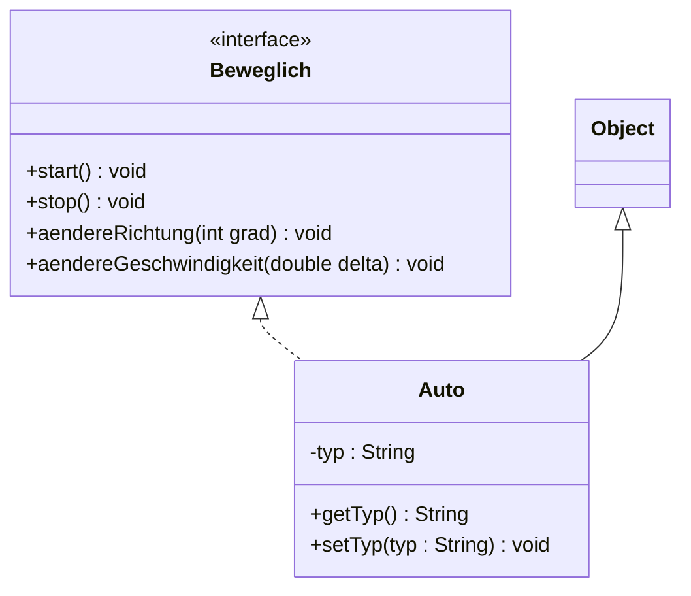
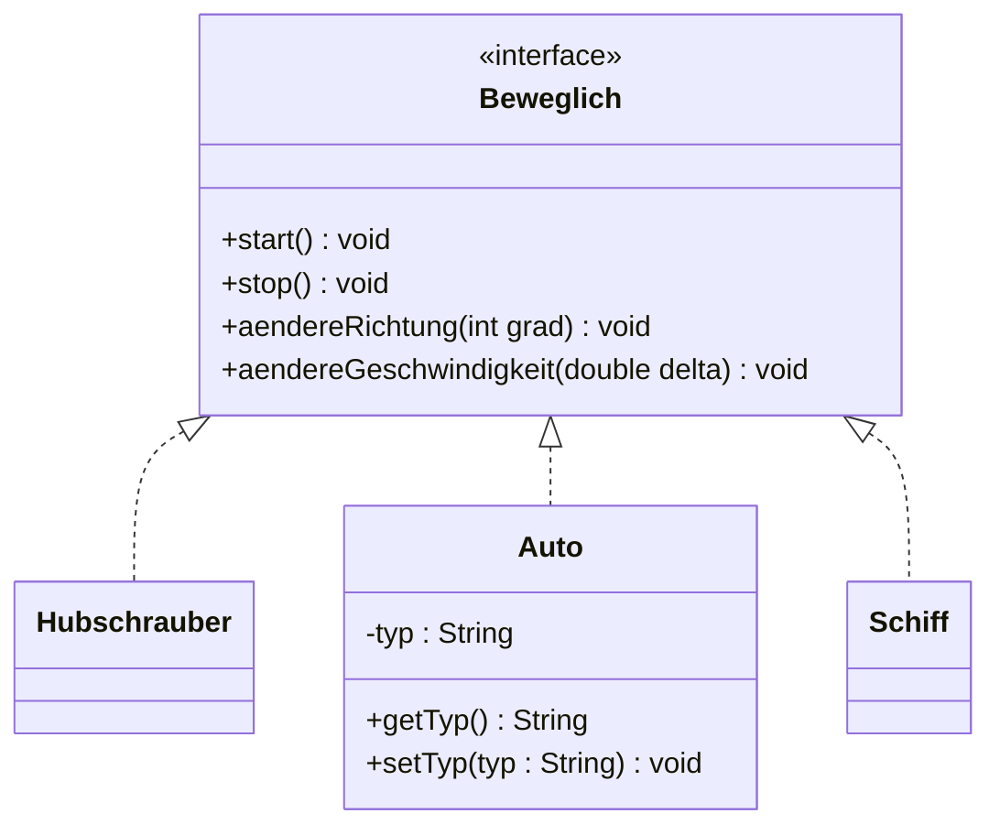
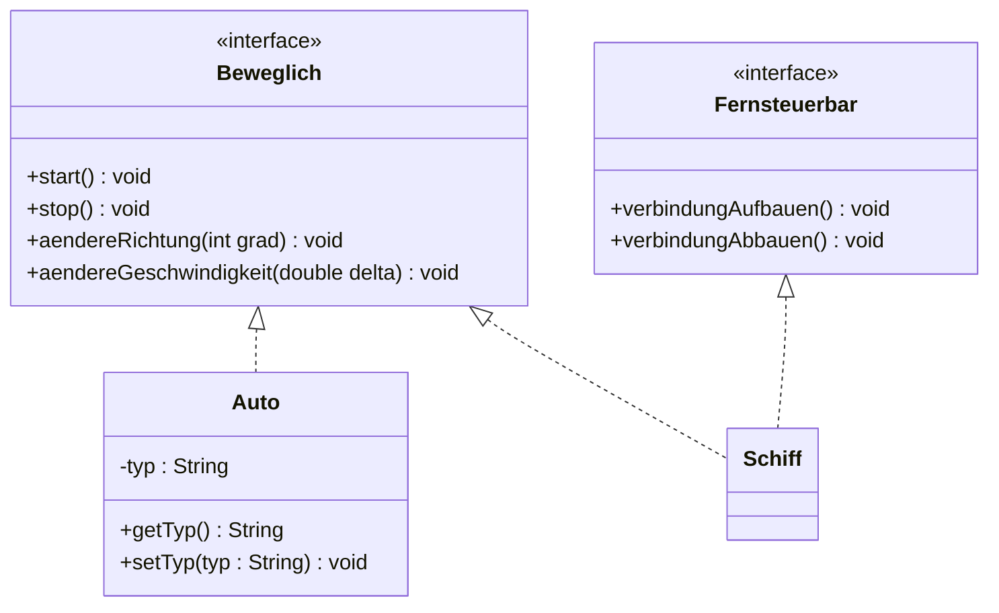
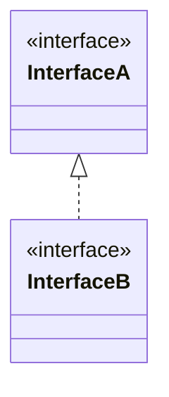

# Navigation

- [Interfaces](#interfaces)
    - [Spezifikation vs. Implementation](#spezifikation-vs-implementierung)
    - [Schnittstellen (Interfaces)](#schnittstellen-interfaces)
    - [Interfaces in Java](#interfaces-in-java)
    - [Verwendung von Schnittstellen](#verwendung-von-schnittstellen)
- [Vergleichen von Referenztypen](#vergleichen-von-referenztypen)
    - [Methode Object.equals](#methode-objectequals)
    - [Methode Object.hashCode](#methode-objecthashcode)
    - [Schnittstelle java.lang.Comparable](#schnittstelle-javalangcomparable)


# Interfaces

## Spezifikation vs. Implementierung

Am Anfang der Entwickelung eines Systems muss zuerst definiert werden, was die Software aus Sicht der Benutzer leisten können muss.
Dies nennt mann: *Spezifikation*

Durch die Spezifikation wird klar was das System leisten muss. Dann kann die Implementierung angefangen werden.

## Schnittstellen (Interfaces)

Für die Beschreibung des Verhaltens eines Systems in Java werden *Schnittstellen* oder auch *Interfaces* genannt, verwendet.
Eine Schnittstelle beschreibt was zu tun ist, ohne auf das wie einzugehen.

Die Implementierung erfolgt mit Hilfe von Klassen, die exakt definieren wie das Verhalten realisiert wird.

- Spezifikation (WAS)    → Schnittstellen   `public interface InterfaceName{ ... }`
- Implementierung (WIE)  → Klassen          `public class KlasseName{ ... }`

Durch die Trennung von Spezifikation und Implementierung wird der Entwurf eines Systems vereinfacht: Das System wird von Anfang an in Subsysteme zerlegt, 
wobei jedes Subsystem ein klare Schnittstelle hat.

Die Implementierung wird erst dann gestartet, wenn die Schnittstellen stabil sind.

### Beispiel

Beispiel mit Vereinsverwaltung Spezifikation in Textform

#### Ziel:

Eine Applikation entwickeln, mit der die Verwaltung von Daten realisiert werden kann, die für Mitglieder einen Vereins relevant sind

#### Frage:

Wie könnte die Spezifikation für eine solche Applikation aussehen und welches Verhalten wird von der Applikation erwartet?

#### Verhalten aus sicht des Benutzers

Welche wesentlichen Funktionalitäten müssen verfügbar sein?

- Mitgliederdaten laden
- Mitglieder hinzufügen, Daten eines Mitglieds bearbeiten, Mitglied entfernen
- Suchen nach Mitglieder mit verschiedenen Suchkriterien

Was muss die Benutzerschnittstelle (GUI) ermöglichen?

- Daten eines Mitglieds erfassen, bearbeiten und entfernen
- Daten sinnvoll anzeigen
- Daten exportieren können

Wie soll die Verwaltung von Daten funktionieren?

- Speichern von Daten
- Aktualisieren von Daten
- Löschen von Daten
- Gezieltes holen von Daten

## Interfaces in Java

Eine Schnittstelle ist in Java ein eigener Type (gleich wie auch eine Klasse oder Enumeration) und wird mit Hilfe des Schlüsselwortes *interface* definiert.
Intefaces enthalten nur die Methodenköpfe (abstrakte Methoden) und Konstanten. Sie haben keine Konstruktoren.

### Beispiel

Beispiel Definition einer Schnittstelle in Java

```java
public interface Beweglich {
    void start();
    void stop();
    void aendereRichtung(int, grad);
    void aendereGeschwindigkeit(double, delta);
}
```
Methoden in einer Schnittstelle sind implizit public und abstract. Aus diesem Grund kann auf die Angabe der Modifikatoren verzichtet werden.

Eine Klasse kann eine oder mehrere Schnittstellen implementieren (realisieren) und eignet sich automatisch den Typ der Schnittstellen an. Die Implementierung
wird mit dem Schlüsselwort *implements* gemachtt.

### Beispiel

Beispiel einer Klasse die eine Schnittstelle realisiert

```java
public class Auto implements Beweglich {
    // Konkrete Implementierung aller Methoden der Schnittstelle
}
```

Die Beziehung zwischen der Schnittstelle und realisierenden Klasse ist eine *implements-Beziehung*

- Die gestrichlete Linie signalisiert, dass die Klasse "Auto" die Schnittstelle erbt ohne Implementation
- Die Klasse "Auto" implementiert alle Methoden der Klasse "Beweglich" → Dadurch ist jede Instanz der Klasse automatisch auch vom Typ "Beweglich"
- Eine Instanz der Klasse "Auto" ist vom Typ Objekt, Auto und Beweglich

#### Interface zu Klassen beziehung



#### Mehrere Klassen implementieren eine Schnittstelle

Eine Schnittstelle kann auch von mehreren Klassen implementiert werden, weil die Schnittstelle eine Abstraktion der Implementierung ist
(gibt das Verhalten vor das implementiert werden soll).



#### Eine Klasse implementiert mehrere Interfaces

Eine klasse kann nur von einer Klasse abgeleitet werden, jedoch kann sie mehrere Interfaces realisieren. Mit jeder realisierenden Schnittstelle erhalten
die Instanzen der Klasse einen weiteren Typ.



Im code:

```java
public class Schiff implements Beweglich, Fernsteuerbar {
    // Implementation
}
```

#### Schnittstellen Vererbung

Eine Schnittstelle kann auch von einer anderen Schnittstelle abgeleitet werden (geerbt werden)



Im code sieht es folgendermassen aus:

```java
public interface InterfaceA {
    void methodeA();
}

public interface InterfaceB extends InterfaceA {
    void methodeX();
}
```

Daraus folgt: Alle Klassen die InterfaceB implementiereun müssen zwingend audch die Methoden implementieren die im InterfaceA vorgegeben sind.

## Verwendung von Schnittstellen

Eine Referenz vom Typ einer Schnittstelle kann auf die Instaz einer beliebigen Klasse zeigen, welche die Schnittstelle implementiert (realisiert).

Biespielsweise:

```java
Beweglich refA = new Auto();
Beweglich refB = new Schiff();
```

Es ist möglich ein Array zu definieren in dem Objekte vom Typ der Schnittstelle verwaltet werden.

Beispielsweise:

```java
Beweglich[] arr new Beweglich[3];
arr[0] = new Auto();
arr[1] = new Schiff();
arr[2] = new Hubschrauber();

for (Beweglich beweglichesObjekt : arr) {
    beweglichesObjekt.start();
}
```

Ob das konkrete beweglichesObjekt vom Typ Auto, Schiff oder Hubschrauber ist, ist irrelevant. der Typ "Beweglich" stellt sicher die Methode start
die objekte bedenkenlos aufrufen kann.

# Vergleichen von Referenztypen

Sobald Objekte sortiert oder gefiltert werden müssen, braucht man eine Möglichkeit, diese Untereinander zu vergleichen. Objekte werden normalerweise nach Inhalt
von Instanzvariablen verglichen. Welche Intanzvariablen berücksichtigt werden muss situativ entschieden werden.

Beim Vergleich von zwei Objekten muss herausgefunden werden ob die Objekte gleich sind, und falls nicht welches "grösser" ist. Die Überprüfung wird mit der
Methode *equals* durchgeführt. Diese Methode existiert bereits als Instanzmethode von der Klasse java.lang.Object (Mutter aller Mütter).

## Methode Object.equals

Die Standard-Implementation der Instanzmethode equals in der Klasse Object vergleicht nur, ob die Objektreferenzen gleich sind.

Im Code:

```java
public boolean equals(Object obj) {
    return (this == obj);
}
```

Beispielsweise:

```java
Point a = new Point(10, 20);
Point b = a;
Point c = new Point(10, 20);

boolean p = a.equals(b);
boolean q = a.equals(c);
```

- p ist TRUE
- q ist FALSE

Da die Standardimplementation von "equals" die Objektidentität / Referenzierung (Speicheraddressierung) vergleicht. Dewegen wird eine eigene
Implementation für die Klasse "Point" benötigt:

```java
public boolean equals (Object obj) {
    // Im ersten Schritt Identität prüfen
    if (this == obj) {
        return true;
    }

    // Im zweiten Schritt überprüfen Objekt vom Typ "Point" ist
    if (!(obj instanceof Point)) {
        return false;
    }

    // Im dritten Schritt Typ von Object Umwandeln zu "Point" (Nur da es von Typ Point ist)
    Point param = (Point)obj;

    // Im letzten Schritt werden die Attribute verglichen
    return this.x == param.x && this.y == param.y
}
```

## Methode Object.hashCode

Wenn die Methode *equals* überschrieben wird, muss die Methode hashCode (eine weitere Methode der Klasse Object) auch überschrieben werden.
Es mussen die gleichen Attribute wie in der Methode Attribute berücksichtigt werden.

Sonst kann die Verwaltung von Instanzer der Klasse in Container wie Hashtable, Hashmap, etc. nicht gemacht werden.

Folgendes muss für die Klasse Point implementiert werden

```java
public int hashCode() {
    return Objects.hash(this.x, this.y);
}
```

## Schnittstelle java.lang.Comparable

Die Schnittstelle Comparable deklariert die Methode *compareTo* und ermöglicht jeder Klasse, explizit anzugeben, wie ihre Instanzen untereinander
verglichen werden sollen. Jede Klasse definiert dafür eine *natürliche Sortierordnung*.

Comparable ist eine generische Schnittstelle, die von beliebigen Klassen implementiert werden kann. Die Realisierung der Schnittstelle wird der Typ
von Instanzen der realisierenden Klassen den Typ *Comparable* erweitert.

```java
public interface Comparable<T> {
    public int compareTo(T o);
}
```

Folgend ein Beispiel wobei die Alter von zwei Personen verglichen werden:

```java
public class Person implements Comparable<Person> {
    private String name;
    private int age;

    public Person(String name, int age) {
        this.name = name;
        this.age = age;
    }

    @Override
    public int compareTo(Person other) {
        // Alter vergleichen
        if (this.age < other.age) return -1;
        if (this.age > other.age) return 1;
        return 0;
    }
}
```

Dies kann beispielsweise folgendermassen im Code verwendet werden:

```java
Person a = new Person("Alice", 20);
Person b = new Person("Bob", 25);

System.out.println(a.compareTo(b));  // -1  (Alice ist jünger)
System.out.println(b.compareTo(a));  //  1  (Bob is älter)
```