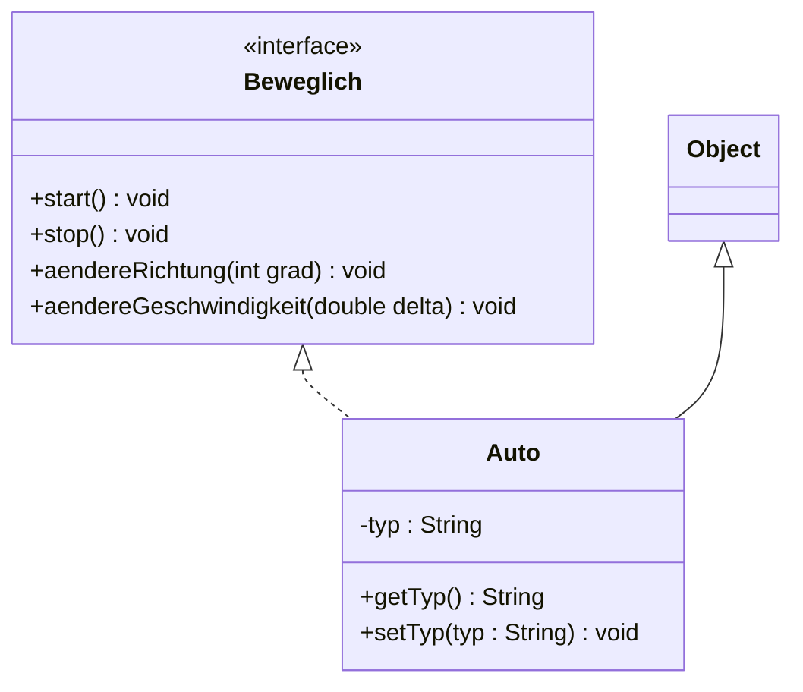
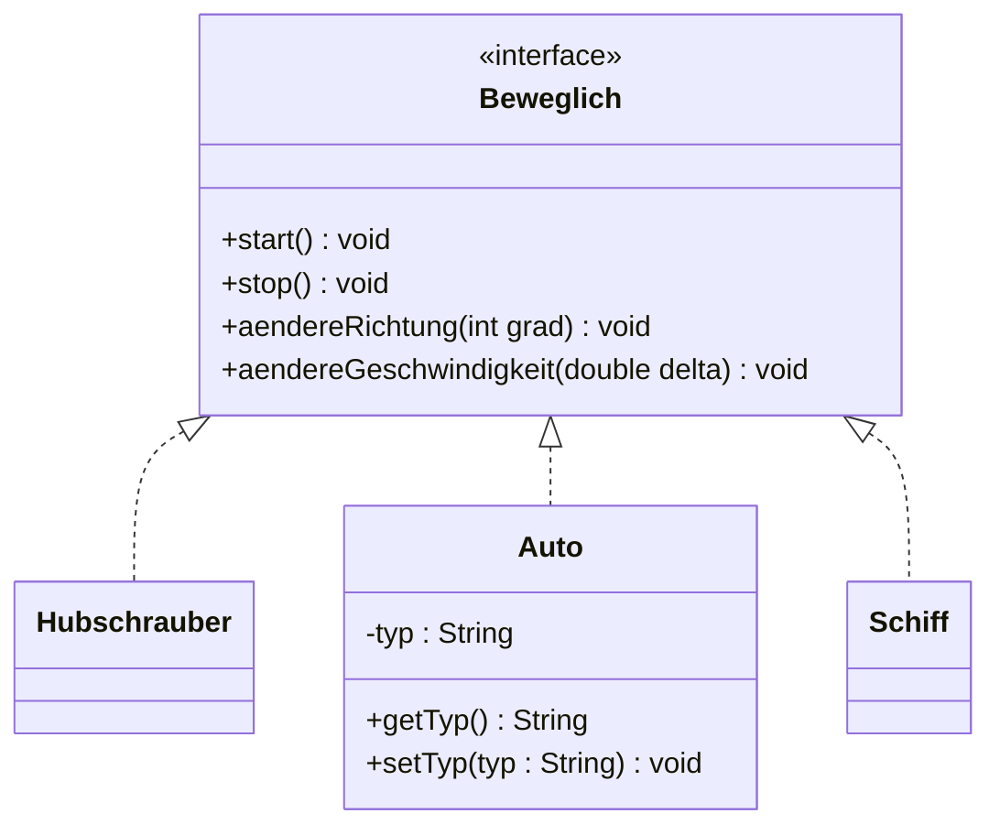
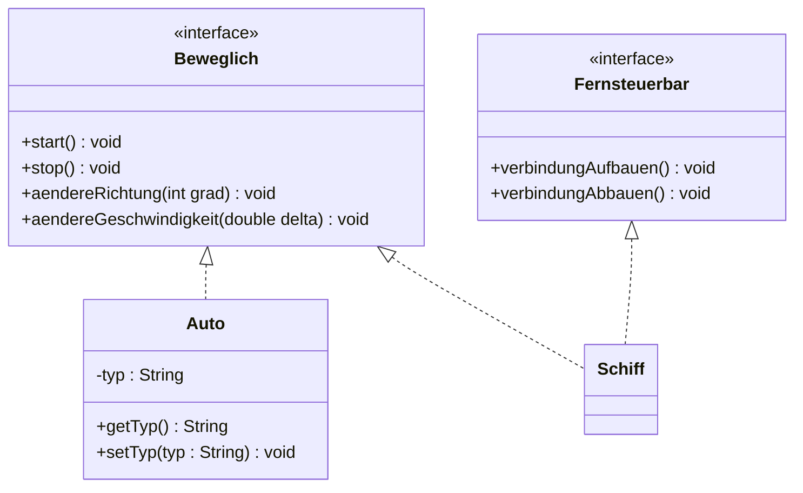
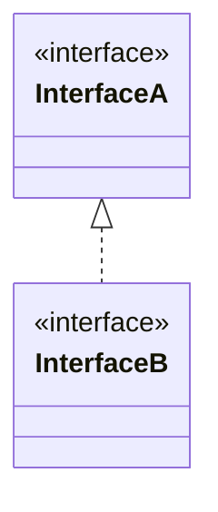

# Interfaces

## Spezifikation vs. Implementierung

Am Anfang der Entwickelung eines Systems muss zuerst definiert werden, was die Software aus Sicht der Benutzer leisten können muss.
Dies nennt mann: *Spezifikation*

Durch die Spezifikation wird klar was das System leisten muss. Dann kann die Implementierung angefangen werden.

## Spezifikation und Schnittstellen

Für die Beschreibung des Verhaltens eines Systems in Java werden *Schnittstellen* oder auch *Interfaces* genannt, verwendet.
Eine Schnittstelle beschreibt was zu tun ist, ohne auf das wie einzugehen.

Die Implementierung erfolgt mit Hilfe von Klassen, die exakt definieren wie das Verhalten realisiert wird.

- Spezifikation (WAS)    → Schnittstellen   `public interface InterfaceName{ ... }`
- Implementierung (WIE)  → Klassen          `public class KlasseName{ ... }`

Durch die Trennung von Spezifikation und Implementierung wird der Entwurf eines Systems vereinfacht: Das System wird von Anfang an in Subsysteme zerlegt, 
wobei jedes Subsystem ein klare Schnittstelle hat.

Die Implementierung wird erst dann gestartet, wenn die Schnittstellen stabil sind.

### Beispiel

Beispiel mit Vereinsverwaltung Spezifikation in Textform

#### Ziel:

Eine Applikation entwickeln, mit der die Verwaltung von Daten realisiert werden kann, die für Mitglieder einen Vereins relevant sind

#### Frage:

Wie könnte die Spezifikation für eine solche Applikation aussehen und welches Verhalten wird von der Applikation erwartet?

#### Verhalten aus sicht des Benutzers

Welche wesentlichen Funktionalitäten müssen verfügbar sein?

- Mitgliederdaten laden
- Mitglieder hinzufügen, Daten eines Mitglieds bearbeiten, Mitglied entfernen
- Suchen nach Mitglieder mit verschiedenen Suchkriterien

Was muss die Benutzerschnittstelle (GUI) ermöglichen?

- Daten eines Mitglieds erfassen, bearbeiten und entfernen
- Daten sinnvoll anzeigen
- Daten exportieren können

Wie soll die Verwaltung von Daten funktionieren?

- Speichern von Daten
- Aktualisieren von Daten
- Löschen von Daten
- Gezieltes holen von Daten

## Interfaces in Java

Eine Schnittstelle ist in Java ein eigener Type (gleich wie auch eine Klasse oder Enumeration) und wird mit Hilfe des Schlüsselwortes *interface* definiert.
Intefaces enthalten nur die Methodenköpfe (abstrakte Methoden) und Konstanten. Sie haben keine Konstruktoren.

### Beispiel

Beispiel Definition einer Schnittstelle in Java

```java
public interface Beweglich {
    void start();
    void stop();
    void aendereRichtung(int, grad);
    void aendereGeschwindigkeit(double, delta);
}
```
Methoden in einer Schnittstelle sind implizit public und abstract. Aus diesem Grund kann auf die Angabe der Modifikatoren verzichtet werden.

Eine Klasse kann eine oder mehrere Schnittstellen implementieren (realisieren) und eignet sich automatisch den Typ der Schnittstellen an. Die Implementierung
wird mit dem Schlüsselwort *implements* gemachtt.

### Beispiel

Beispiel einer Klasse die eine Schnittstelle realisiert

```java
public class Auto implements Beweglich {
    // Konkrete Implementierung aller Methoden der Schnittstelle
}
```

Die Beziehung zwischen der Schnittstelle und realisierenden Klasse ist eine *implements-Beziehung*

- Die gestrichlete Linie signalisiert, dass die Klasse "Auto" die Schnittstelle erbt ohne Implementation
- Die Klasse "Auto" implementiert alle Methoden der Klasse "Beweglich" → Dadurch ist jede Instanz der Klasse automatisch auch vom Typ "Beweglich"
- Eine Instanz der Klasse "Auto" ist vom Typ Objekt, Auto und Beweglich

#### Interface zu Klassen beziehung



#### Mehrere Klassen implementieren eine Schnittstelle

Eine Schnittstelle kann auch von mehreren Klassen implementiert werden, weil die Schnittstelle eine Abstraktion der Implementierung ist
(gibt das Verhalten vor das implementiert werden soll).



#### Eine Klasse implementiert mehrere Interfaces

Eine klasse kann nur von einer Klasse abgeleitet werden, jedoch kann sie mehrere Interfaces realisieren. Mit jeder realisierenden Schnittstelle erhalten
die Instanzen der Klasse einen weiteren Typ.



Im code:

```java
public class Schiff implements Beweglich, Fernsteuerbar {
    // Implementation
}
```


#### Schnittstellen Vererbung

Eine Schnittstelle kann auch von einer anderen Schnittstelle abgeleitet werden (geerbt werden)



Im code sieht es folgendermassen aus:

```java
public interface InterfaceA {
    void methodeA();
}

public interface InterfaceB extends InterfaceA {
    void methodeX();
}
```

Daraus folgt: Alle Klassen die InterfaceB implementiereun müssen zwingend audch die Methoden implementieren die im InterfaceA vorgegeben sind.

