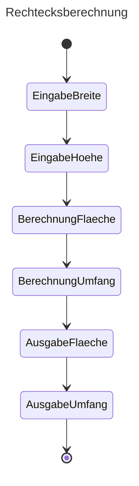

# Übungen Block 01

[Ilias link to Module](https://elearning.hslu.ch/ilias/ilias.php?baseClass=ilrepositorygui&cmdNode=z8:ob&cmdClass=ilObjFileGUI&cmd=sendfile&ref_id=6847906)


### Componants

javac

java


## Aufgabe 1



http://www.guru99.com/java-platform.html

### Was ist eine Plattform?

### Java ist eine Programmiersprache und Plattform, was bedeutet dies?

## Aufgabe 2

## Aufgabe 3

Alle fehler im Code finden.

> [!TIP]
> Want an easy way to test?
> docker run -it openjdk:26-trixie bash

```java
public class Aufgabe3 {
    public static void main ( String [] args ) {
        // Variablen
        double guthaben = 1000;
        int zinsSatz = 3;
        int guthaben mit Zinsen;
        // Verarbeitung
        guthaben mit Zinsen = guthaben * (1 + zinsSatz / 100); // Variable cannot contain whitespaces
        // Ausgabe
        system.out.println ( guthabenMitZinsen ); // System with capital S
) // Invalid end of programm -> missing }}
```

## Aufgabe 4

Das Programm ist syntaktisch korrekt und kann von Anfang an fehlerlos kompiliert werden.

```java
import java.util.Scanner;
public class Aufgabe4 {
    public static void main(String[] args) {
        // Variablen
        double guthaben;
        double zinsSatz = 1.5;
        double guthabenMitZinsen;
        // Eingabe
        Scanner sc = new Scanner (System.in);
        System.out.print ("Geben Sie ein Guthaben ein:");
        guthaben = sc.nextDouble();
        // Verarbeitung
        guthabenMitZinsen = guthaben * (1 + zinsSatz / 100);
        // Ausgabe
        System.out.println("Guthaben nach einem Jahr:" + guthabenMitZinsen);
    }
}
```

What is `java.util.Scanner`?
A util package that takes input from user and expects any primitive datatype (int, float, string, etc...)
It can be called using System.in

When the program recieves an input it multiplies it by 1 + the hardcoded zinsSatz double divided by 100

The zinsSatz variable is always 1.5

## Aufgabe 5


