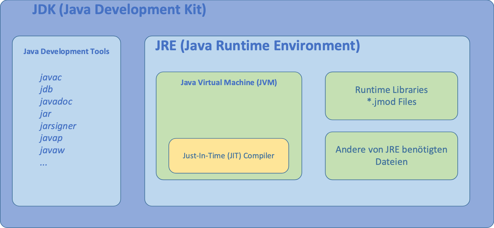

# Introduction

## JRE vs JDK

Java Runtime Evironment vs Java Development Kit

JRE -> Environment necessary to execute java code
JDK -> Additionally contains the Compiler, Debugger, etc.



## Java Componants

TBD

## Java History

## JIT (Just-In-Time) Compiler

## Algorythms 

## Variables and Types

### Variables

A variable is nothing more than a storage address to the compiler. In order for it to be readable it recieves name. A variable always has a name, type and value.

Syntax: Typ Variablename;
Ex:     int startValue;

Variable with initialization

Syntax: Typ Variablename = Standardvalue;
Ex:     int startValue = 25;

Ex:

```java
aktuellerValue = 10;                 // Variable is initialized with the value 10
aktuellerValue = aktuellerValue + 1;  // Variables value is increased by 1
```

### Types

int
double
String
boolean
byte
char
short
long
float

## Input and Output

### Using user input

`import java.util.Scanner;` is an instruction to the compiler where it can find the util scanner on the disk 

`Scanner scanner = new Scanner(System.in);` 

Ex: 

- [Rechtecksrechner](/RechtecksRechner.java)
- [Kraftrechner](/1.BA/PRG.H2503/block01/Kraftrechner.java)

%d -> int, long, short, byte
%f -> floating-point
%s -> strings
%c -> characters
%b -> boolean values


