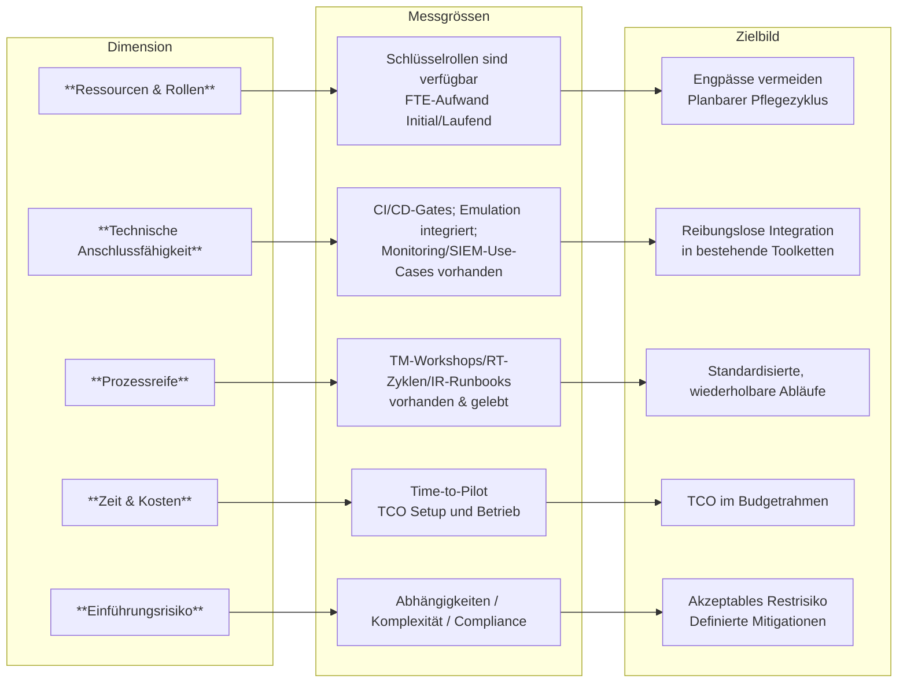

```mermaid
flowchart LR
  subgraph D[Dimension]
    D1[**Ressourcen & Rollen**]
    D2[**Technische Anschlussfähigkeit**]
    D3[**Prozessreife**]
    D4[**Zeit & Kosten**]
    D5[**Einführungsrisiko**]
  end

  subgraph M[Messgrössen]
    M1[Schlüsselrollen sind verfügbar<br/>FTE-Aufwand Initial/Laufend]
    M2[CI/CD-Gates; Emulation integriert;<br/>Monitoring/SIEM-Use-Cases vorhanden]
    M3[TM-Workshops/RT-Zyklen/IR-Runbooks<br/>vorhanden & gelebt]
    M4[Time-to-Pilot<br/>TCO Setup und Betrieb]
    M5[Abhängigkeiten / Komplexität / Compliance]
  end

  subgraph Z[Zielbild]
    Z1[Engpässe vermeiden<br/>Planbarer Pflegezyklus]
    Z2[Reibungslose Integration<br/>in bestehende Toolketten]
    Z3[Standardisierte, wiederholbare Abläufe]
    Z4[TCO im Budgetrahmen]
    Z5[Akzeptables Restrisiko<br/>Definierte Mitigationen]
  end

  D1 --> M1 --> Z1
  D2 --> M2 --> Z2
  D3 --> M3 --> Z3
  D4 --> M4 --> Z4
  D5 --> M5 --> Z5
```